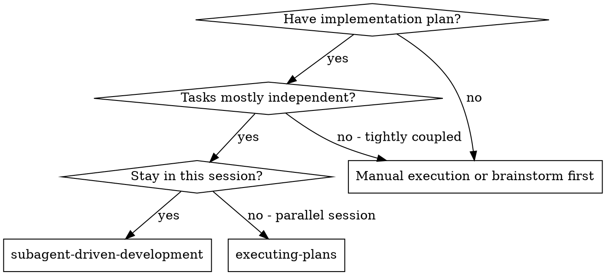
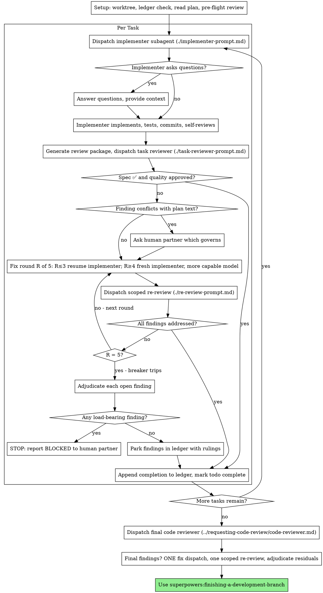

# SDD Fix-Loop Redesign Implementation Plan

> **For agentic workers:** REQUIRED SUB-SKILL: Use superpowers:subagent-driven-development (recommended) or superpowers:executing-plans to implement this plan task-by-task. Steps use checkbox (`- [ ]`) syntax for tracking.

**Goal:** Make subagent-driven-development's review-fix loop convergent and autonomous (resume-the-implementer fix rounds, scoped re-reviews, five-round breaker, controller adjudication) and reorganize its SKILL.md by lifecycle — with quorum eval evidence.

**Architecture:** Two repos. The `superpowers` repo (branch `sdd-fix-loop-redesign`, already created; spec committed) gets the skill restructure: one new prompt template, two template edits, one reference edit, and the SKILL.md rewrite whose full text is in Task 3. The `superpowers-evals` repo (`evals/` checkout; create branch `sdd-fix-loop-scenarios` off `main`) gets two seeded-ledger fixture helpers and three scenarios, then a live before/after campaign.

**Tech Stack:** Markdown skill content; Bash scenario DSL (`story.md`/`setup.sh`/`checks.sh`); TypeScript setup-helpers on Bun (`bun test`); quorum live runs.

**Design spec:** `docs/superpowers/specs/2026-07-15-sdd-fix-loop-redesign-design.md`. Read it before starting any task.

## Global Constraints

- **Verbatim-move rule:** eval-tuned sentences from the current SKILL.md move unchanged. Only fix-policy language may be reworded, and every rewording appears in Task 3's move map. Do not "improve" moved prose.
- **Round cap:** 5 fix rounds per task. Rounds 1–3 resume the original implementer; rounds 4–5 dispatch a fresh implementer on a more capable model. Adjudication happens only at the cap; the one earlier exit is a finding that conflicts with plan text (human decides, existing behavior).
- **Ledger line formats** (exact — scenarios grep for these; `<sha7>` = 7-char short SHA):
  - `Task <N>: complete (commits <base7>..<head7>, review clean)`
  - `Task <N>: complete (commits <base7>..<head7>, <K> parked)`
  - `Task <N>: fix round <R>/5 (<X> addressed, <Y> open — <finding one-liner>[; <finding one-liner>…]; commits <a7>..<b7>)`
  - `Task <N>: minor (deferred): <one-liner>`
  - `Task <N>: parked — <finding one-liner> — ruling: <one-liner>`
  - `Task <N>: BLOCKED — <one-liner>`
  - Resume rule: a task is DONE iff it has a `Task <N>: complete` line.
- **Template placeholders** keep the existing bracket convention: `[MODEL]`, `[BRIEF_FILE]`, `[REPORT_FILE]`, `[BASE_SHA]`, `[HEAD_SHA]`, `[DIFF_FILE]`, `[GLOBAL_CONSTRAINTS]`; the new re-review template adds `[FINDINGS]`, `[FIX_BASE_SHA]`.
- **Commit discipline:** superpowers commits on `sdd-fix-loop-redesign`; evals commits on `sdd-fix-loop-scenarios` (separate repo — `cd evals` first). Never commit one repo's work from the other.
- **Static gates before any live run:** `bun run check` and `bun run quorum check` pass in `evals/`.
- **Live runs are trusted-maintainer operations** — they need `SUPERPOWERS_ROOT`, an `ANTHROPIC_API_KEY`, and cost real money (~$3–15 per SDD run). Task 8 marks them explicitly.
- **Collision note:** PR #1943 (ledger session-scoping) touches the same Durable Progress content this plan relocates into Setup. Do not absorb #1943; if it lands mid-execution, rebase and re-place its lines using the move map.

## File Structure

**superpowers repo:**
- Create: `skills/subagent-driven-development/re-review-prompt.md` — scoped re-review contract (Task 1)
- Modify: `skills/subagent-driven-development/implementer-prompt.md` — resume semantics (Task 2)
- Modify: `skills/subagent-driven-development/task-reviewer-prompt.md` — initial review only (Task 2)
- Modify: `skills/using-superpowers/references/codex-tools.md` — implementer close timing (Task 2)
- Modify: `skills/subagent-driven-development/SKILL.md` — full restructure (Task 3)

**superpowers-evals repo (`evals/`):**
- Modify: `src/setup-helpers/sdd-fixtures.ts` — add `scaffoldSddMidloopParked`, `scaffoldSddMidloopStructural` (Task 4)
- Modify: `src/setup-helpers/registry.ts` — register both helpers (Task 4)
- Modify: `test/setup-helpers-sdd.test.ts` — unit tests for both helpers (Task 4)
- Create: `scenarios/sdd-fix-loop-resumes-implementer/{story.md,setup.sh,checks.sh}` (Task 5)
- Create: `scenarios/sdd-breaker-adjudicates-at-cap/{story.md,setup.sh,checks.sh}` (Task 6)
- Create: `scenarios/sdd-breaker-structural-blocks/{story.md,setup.sh,checks.sh}` (Task 7)
- Create: `docs/experiments/2026-07-sdd-fix-loop-redesign.md` — campaign log (Task 8)

---

### Task 1: Create the scoped re-review template

**Files:**
- Create: `skills/subagent-driven-development/re-review-prompt.md`

**Interfaces:**
- Produces: template placeholders `[MODEL]`, `[BRIEF_FILE]`, `[REPORT_FILE]`, `[FINDINGS]`, `[FIX_BASE_SHA]`, `[HEAD_SHA]`, `[DIFF_FILE]` — Task 3's SKILL.md step 4 links this file and instructs the controller to fill exactly these.

- [ ] **Step 1: Write the file with exactly this content**

````markdown
# Scoped Re-Review Prompt Template

Use this template when dispatching a re-review after a fix round. The
re-reviewer verifies the findings were addressed and checks the fix diff for
new breakage. It is not a fresh review — the full review already happened.

**Purpose:** Verify each finding from the previous review was addressed, and
that the fix itself broke nothing.

```
Subagent (general-purpose):
  description: "Re-review Task N fix round R"
  model: [MODEL — REQUIRED: choose per SKILL.md Model Selection; an omitted
         model silently inherits the session's most expensive one]
  prompt: |
    You are re-reviewing one task's fix round. A previous review produced
    findings; an implementer has attempted to fix them. Your job is to
    verdict each finding and inspect the fix diff — nothing else.

    ## The Task

    Read the task brief: [BRIEF_FILE]

    ## The Findings Under Verification

    [FINDINGS]

    ## The Fix

    Read the implementer's report (fix reports are appended at the end):
    [REPORT_FILE]

    **Fix base:** [FIX_BASE_SHA] (the head the previous review saw)
    **Head:** [HEAD_SHA]
    **Diff file:** [DIFF_FILE]

    Read the diff file once — it contains the fix commits, a stat summary,
    and the fix diff with surrounding context. Do not re-run git commands.
    If the diff file is missing, fetch the diff yourself:
    `git diff --stat [FIX_BASE_SHA]..[HEAD_SHA]` and
    `git diff [FIX_BASE_SHA]..[HEAD_SHA]`.

    Your review is read-only on this checkout. Do not mutate the working
    tree, the index, HEAD, or branch state in any way.

    ## Scope

    Your scope is the findings list and the fix diff. Verdict every finding.
    Inspect the fix diff for new problems the fix itself introduced. Do NOT
    re-review code the fix did not touch: if you notice an issue entirely
    outside the fix diff, report it under Out-of-Scope Observations — it
    does not block this task and does not extend the loop. A broad
    whole-branch review happens after all tasks are complete.

    ## Tests

    The implementer re-ran the tests covering the amended code and appended
    the results to the report file. Treat the report as unverified claims:
    confirm the fix report names the covering tests and shows their output,
    and verify the claims against the diff. Do not re-run the suite to
    confirm their report. Run a test only when reading the code raises a
    specific doubt that no existing run answers — and then a focused test,
    never a package-wide suite.

    ## Output Format

    Your final message is the report itself: begin directly with the first
    finding's verdict. Every line is a verdict, a finding with file:line,
    or a check you ran — no preamble, no process narration.

    ### Finding Verdicts

    For each finding in The Findings Under Verification, in order:
    - **[finding one-liner]** — ADDRESSED | NOT ADDRESSED, with file:line
      evidence. "Attempted" is not addressed: the specific defect must no
      longer exist.

    ### New Breakage in the Fix Diff

    Anything the fix itself broke or introduced, with severity
    (Critical/Important/Minor) and file:line. "None" if clean.

    ### Out-of-Scope Observations

    Issues you noticed entirely outside the fix diff. Non-blocking; the
    controller ledgers these for the final review. "None" if none.

    ### Verdict

    **Fix round:** [All findings addressed, no new Critical/Important
    breakage | Findings remain open] — list the open ones.
```

**Placeholders:**
- `[MODEL]` — REQUIRED: reviewer model per SKILL.md Model Selection; scoped
  re-reviews of small fix diffs take a cheap-to-mid tier
- `[BRIEF_FILE]` — the task brief file (same file the implementer worked from)
- `[FINDINGS]` — the Critical/Important findings and spec gaps from the
  previous review, copied verbatim, one per bullet
- `[REPORT_FILE]` — the implementer's report file (fix reports appended)
- `[FIX_BASE_SHA]` — the head the previous review saw
- `[HEAD_SHA]` — current commit
- `[DIFF_FILE]` — the path `scripts/review-package FIX_BASE HEAD` printed

**Re-reviewer returns:** per-finding verdicts (ADDRESSED / NOT ADDRESSED),
new breakage in the fix diff, out-of-scope observations, and a round verdict.
````

- [ ] **Step 2: Verify the file parses as the other templates do**

Run: `grep -c '^\[MODEL' skills/subagent-driven-development/re-review-prompt.md`
Expected: `0` (placeholder docs use `- \`[MODEL]\`` list form, matching task-reviewer-prompt.md)

Run: `grep -n 'FIX_BASE_SHA' skills/subagent-driven-development/re-review-prompt.md | head -3`
Expected: hits in the prompt body and the placeholder list.

- [ ] **Step 3: Commit**

```bash
git add skills/subagent-driven-development/re-review-prompt.md
git commit -m "feat(sdd): add scoped re-review prompt template"
```

---

### Task 2: Align the implementer and task-reviewer templates and the Codex reference with resume semantics

**Files:**
- Modify: `skills/subagent-driven-development/implementer-prompt.md` (the "After Review Findings" section)
- Modify: `skills/subagent-driven-development/task-reviewer-prompt.md` (trailing paragraph)
- Modify: `skills/using-superpowers/references/codex-tools.md` (subagent close timing)

**Interfaces:**
- Consumes: `re-review-prompt.md` exists (Task 1).
- Produces: the implementer contract Task 3's fix loop cites ("fix, re-run covering tests, append to your report file, return the short contract").

- [ ] **Step 1: Replace the "After Review Findings" section in implementer-prompt.md**

Old text (exact):

```markdown
    ## After Review Findings

    If a reviewer finds issues and you fix them, re-run the tests that cover
    the amended code and append the results to your report file. Reviewers
    will not re-run tests for you — your report is the test evidence.
```

New text (exact):

```markdown
    ## After Review Findings

    If the task review finds issues, you will be resumed with the findings.
    Fix them, re-run the tests that cover the amended code, and append a fix
    report to your report file: what you changed, the covering tests you
    ran, the command, and the output. Reviewers will not re-run tests for
    you — your report is the test evidence. Then reply with the same short
    status contract as your first report.
```

- [ ] **Step 2: Delete the trailing re-review paragraph in task-reviewer-prompt.md**

Delete this text (exact, at end of file):

```markdown
A fix dispatch can address spec gaps and quality findings together;
re-review after fixes covers both verdicts.
```

Nothing replaces it — the scoped re-review contract now lives in
`re-review-prompt.md`, and SKILL.md step 4 (Task 3) owns the loop rules.

- [ ] **Step 3: Update the Codex subagent close-timing sentence in codex-tools.md**

Old text (exact, line 10):

```markdown
When using subagent-driven-development, you should always close implementer and reviewer subagents when they have finished all their work.
```

New text (exact):

```markdown
When using subagent-driven-development, close reviewer subagents when their review returns. Keep each implementer subagent open until its task's review passes — the fix loop resumes the implementer — then close it. If your harness cannot send another message to a spawned agent, dispatch each fix round as a fresh implementer carrying the brief, the report file, and the findings.
```

- [ ] **Step 4: Verify no template still references dedicated fix subagents**

Run: `grep -rn "fix subagent" skills/subagent-driven-development/*.md`
Expected: no output (SKILL.md still has hits until Task 3 — this command scopes to templates only after Task 3; at this point expect hits ONLY in SKILL.md).

Run: `grep -rn "fix subagent" skills/subagent-driven-development/implementer-prompt.md skills/subagent-driven-development/task-reviewer-prompt.md skills/subagent-driven-development/re-review-prompt.md`
Expected: no output.

- [ ] **Step 5: Commit**

```bash
git add skills/subagent-driven-development/implementer-prompt.md skills/subagent-driven-development/task-reviewer-prompt.md skills/using-superpowers/references/codex-tools.md
git commit -m "feat(sdd): align templates and codex reference with resume-based fix rounds"
```

---

### Task 3: Restructure SKILL.md by lifecycle with the fix loop and rationalization table

**Files:**
- Modify: `skills/subagent-driven-development/SKILL.md` (full-file replacement; new text below)

**Interfaces:**
- Consumes: all three templates (Tasks 1–2); `scripts/task-brief`, `scripts/review-package`, `scripts/sdd-workspace` (unchanged).
- Produces: the ledger line formats in Global Constraints (scenarios grep them); section names `Setup`, `The Task Loop`, `Final Review`, `Common Rationalizations`.

- [ ] **Step 1: Replace the entire SKILL.md body with exactly this content**

`````markdown
---
name: subagent-driven-development
description: Use when executing implementation plans with independent tasks in the current session
---

# Subagent-Driven Development

Execute plan by dispatching a fresh implementer subagent per task, a task review (spec compliance + code quality) after each, and a broad whole-branch review at the end.

**Why subagents:** You delegate tasks to specialized agents with isolated context. By precisely crafting their instructions and context, you ensure they stay focused and succeed at their task. They should never inherit your session's context or history — you construct exactly what they need. This also preserves your own context for coordination work.

**Core principle:** Fresh subagent per task + task review (spec + quality) + broad final review = high quality, fast iteration

**Narration:** between tool calls, narrate at most one short line — the
ledger and the tool results carry the record.

**Continuous execution:** Do not pause to check in with your human partner between tasks. Execute all tasks from the plan without stopping. The only reasons to stop are: BLOCKED status you cannot resolve, ambiguity that genuinely prevents progress, or all tasks complete. "Should I continue?" prompts and progress summaries waste their time — they asked you to execute the plan, so execute it.

## When to Use



**vs. Executing Plans (parallel session):**
- Same session (no context switch)
- Fresh subagent per task (no context pollution)
- Review after each task (spec compliance + code quality), broad review at the end
- Faster iteration (no human-in-loop between tasks)

## The Process



## Setup

Ensure the work happens in an isolated workspace: use
superpowers:using-git-worktrees to create one or verify the existing one.
Never start implementation on a main/master branch without your human
partner's explicit consent.

Conversation memory does not survive compaction. In real sessions,
controllers that lost their place have re-dispatched entire completed task
sequences — the single most expensive failure observed. Track progress in
a ledger file, not only in todos.

- At skill start, check for a ledger:
  `cat "$(git rev-parse --show-toplevel)/.superpowers/sdd/progress.md"`. Tasks with
  a `Task <N>: complete` line are DONE — do not re-dispatch them; resume at
  the first task without one. A task whose last line is a fix round is
  mid-loop: resume the loop at the next round.
- The ledger is your recovery map: the commits it names exist in git even
  when your context no longer remembers creating them. After compaction,
  trust the ledger and `git log` over your own recollection.
- `git clean -fdx` will destroy the ledger (it's git-ignored scratch); if
  that happens, recover from `git log`.

Read the plan once, note its context and Global Constraints, and create a
todo per task.

Before dispatching Task 1, scan the plan once for conflicts:

- tasks that contradict each other or the plan's Global Constraints
- anything the plan explicitly mandates that the review rubric treats as a
  defect (a test that asserts nothing, verbatim duplication of a logic block)

Present everything you find to your human partner as one batched question —
each finding beside the plan text that mandates it, asking which governs —
before execution begins, not one interrupt per discovery mid-plan. If the
scan is clean, proceed without comment. The review loop remains the net for
conflicts that only emerge from implementation.

## Model Selection

Use the least powerful model that can handle each role to conserve cost and increase speed.

**Mechanical implementation tasks** (isolated functions, clear specs, 1-2 files): use a fast, cheap model. Most implementation tasks are mechanical when the plan is well-specified.

**Integration and judgment tasks** (multi-file coordination, pattern matching, debugging): use a standard model.

**Architecture and design tasks**: use the most capable available model.
The final whole-branch review is one of these — dispatch it on the most
capable available model, not the session default.

**Review tasks**: choose the model with the same judgment, scaled to the
diff's size, complexity, and risk. A small mechanical diff does not need the
most capable model; a subtle concurrency change does. Scoped re-reviews of
small fix diffs take a cheap-to-mid tier.

**Fix-loop escalation (rounds 4-5)**: use a model at least one tier above
the implementer that got stuck.

**Always specify the model explicitly when dispatching a subagent.** An
omitted model inherits your session's model — often the most capable and
most expensive — which silently defeats this section.

**Turn count beats token price.** Wall-clock and context cost scale with how
many turns a subagent takes, and the cheapest models routinely take 2-3× the
turns on multi-step work — costing more overall. Use a mid-tier model as the
floor for reviewers and for implementers working from prose descriptions.
When the task's plan text contains the complete code to write, the
implementation is transcription plus testing: use the cheapest tier for
that implementer. Single-file mechanical fixes also take the cheapest tier.

**Task complexity signals (implementation tasks):**
- Touches 1-2 files with a complete spec → cheap model
- Touches multiple files with integration concerns → standard model
- Requires design judgment or broad codebase understanding → most capable model

## The Task Loop

Everything you paste into a dispatch prompt — and everything a subagent
prints back — stays resident in your context for the rest of the session
and is re-read on every later turn. Hand artifacts over as files.

### 1. Dispatch the implementer

Record BASE (`git rev-parse HEAD`) before dispatching — the review package
and fix-round diffs need it.

- **Task brief:** run this skill's `scripts/task-brief PLAN_FILE N` — it
  extracts the task's full text to a uniquely named file and prints the
  path. Compose the dispatch so the brief stays the single source of
  requirements. Your dispatch should contain: (1) one line on where this
  task fits in the project; (2) the brief path, introduced as "read this
  first — it is your requirements, with the exact values to use verbatim";
  (3) interfaces and decisions from earlier tasks that the brief cannot
  know; (4) your resolution of any ambiguity you noticed in the brief;
  (5) the report-file path and report contract. Exact values (numbers,
  magic strings, signatures, test cases) appear only in the brief. Never
  make a subagent read the whole plan file.
- **Report file:** name the implementer's report file after the brief
  (brief `…/task-N-brief.md` → report `…/task-N-report.md`) and put it in
  the dispatch prompt. The implementer writes the full report there and
  returns only status, commits, a one-line test summary, and concerns.
- A dispatch prompt describes one task, not the session's history. Do not
  paste accumulated prior-task summaries ("state after Tasks 1-3") into
  later dispatches — a real session's dispatch hit 42k chars of which 99%
  was pasted history. A fresh subagent needs its task, the interfaces it
  touches, and the global constraints. Nothing else.
- If an earlier task parked a finding in the area this task touches, carry
  a pointer to that ledger entry in the dispatch.
- Record the implementer's agent identity from the dispatch result —
  fix-loop rounds 1-3 resume this agent.
- Never dispatch multiple implementation subagents in parallel (conflicts).

Template: [implementer-prompt.md](implementer-prompt.md)

### 2. Handle the report

Implementer subagents report one of four statuses. Handle each appropriately:

**DONE:** Generate the review package (`scripts/review-package BASE HEAD`, from this skill's directory — it prints the unique file path it wrote; BASE is the commit you recorded before dispatching the implementer — never `HEAD~1`, which silently drops all but the last commit of a multi-commit task), then dispatch the task reviewer with the printed path.

**DONE_WITH_CONCERNS:** The implementer completed the work but flagged doubts. Read the concerns before proceeding. If the concerns are about correctness or scope, address them before review. If they're observations (e.g., "this file is getting large"), note them and proceed to review.

**NEEDS_CONTEXT:** The implementer needs information that wasn't provided. Provide the missing context and re-dispatch.

**BLOCKED:** The implementer cannot complete the task. Assess the blocker:
1. If it's a context problem, provide more context and re-dispatch with the same model
2. If the task requires more reasoning, re-dispatch with a more capable model
3. If the task is too large, break it into smaller pieces
4. If the plan itself is wrong, escalate to the human

**Never** ignore an escalation or force the same model to retry without changes. If the implementer said it's stuck, something needs to change.

If the implementer asks questions — before starting or mid-task — answer
clearly and completely, provide additional context if needed, and don't
rush it into implementation.

### 3. Review the task

Per-task reviews are task-scoped gates. The broad review happens once, at the
final whole-branch review. Never skip the task review, and never accept a
report missing either verdict — spec compliance AND task quality are both
required. Implementer self-review never replaces the task review; both are
needed.

- Hand the reviewer its diff as a file: run this skill's
  `scripts/review-package BASE HEAD` and pass the reviewer the file path
  it prints (or, without bash: `git log --oneline`, `git diff --stat`,
  and `git diff -U10` for the range, redirected to one uniquely named
  file). The output never enters your own context, and the reviewer sees
  the commit list, stat summary, and full diff with context in one Read
  call. Use the BASE you recorded before dispatching the implementer —
  never `HEAD~1`, which silently truncates multi-commit tasks. Never
  dispatch a task reviewer without a diff file.
- The task reviewer gets three paths — the same brief file, the report
  file, and the review package — plus the global constraints that bind
  the task.
- The global-constraints block you hand the reviewer is its attention
  lens. Copy the binding requirements verbatim from the plan's Global
  Constraints section or the spec: exact values, exact formats, and the
  stated relationships between components ("same layout as X", "matches
  Y"). The reviewer's template already carries the process rules (YAGNI,
  test hygiene, review method) — the constraints block is for what THIS
  project's spec demands.
- Do not add open-ended directives like "check all uses" or "run race tests
  if useful" without a concrete, task-specific reason
- Do not ask a reviewer to re-run tests the implementer already ran on the
  same code — the implementer's report carries the test evidence
- Do not pre-judge findings for the reviewer — never instruct a reviewer to
  ignore or not flag a specific issue. If you believe a finding would be a
  false positive, let the reviewer raise it and adjudicate it in the review
  loop. If the prompt you are writing contains "do not flag," "don't treat X
  as a defect," "at most Minor," or "the plan chose" — stop: you are
  pre-judging, usually to spare yourself a review loop.

The task reviewer may report "⚠️ Cannot verify from diff" items — requirements
that live in unchanged code or span tasks. These do not block the rest of the
review, but you must resolve each one yourself before marking the task
complete: you hold the plan and cross-task context the reviewer
lacks. If you confirm an item is a real gap, treat it as a failed spec
review — it enters the fix loop with the other findings.

Template: [task-reviewer-prompt.md](task-reviewer-prompt.md)

### 4. The fix loop

The loop triggers when the review reports spec ❌, any Critical or Important
finding, or a ⚠️ item you confirmed as a real gap.

Before the loop starts, two routes leave it immediately:

- Record Minor findings in the progress ledger as you go
  (`Task <N>: minor (deferred): <one-liner>`), and point the final
  whole-branch review at that list so it can triage which must be fixed
  before merge. A roll-up nobody reads is a silent discard. Minor findings
  never enter the loop.
- A finding labeled plan-mandated — or any finding that conflicts with
  what the plan's text requires — is the human's decision, like any plan
  contradiction: present the finding and the plan text, ask which governs.
  Do not dismiss the finding because the plan mandates it, and do not
  dispatch a fix that contradicts the plan without asking.

Everything else enters the loop. A fix round is one fix dispatch plus one
scoped re-review. Five rounds maximum per task:

**Rounds 1-3 — resume the original implementer.** Send it the open findings
verbatim. Its context is intact: it knows the task, the code, and its own
choices. If your harness cannot send another message to a live subagent,
dispatch a fresh implementer carrying the brief path, the report-file path,
and the findings — the report file is the persistent memory either way.

**Rounds 4-5 — dispatch a fresh implementer on a more capable model** (per
Model Selection), with the brief path, the report-file path, the open
findings, and this framing: "A prior implementer attempted this task
[N] times; you own it now. Read the report file for what was tried." A loop
that survives three resumes usually means the implementer cannot see its
own problem — fresh eyes and a capability bump in one move.

**Every round, either way:** the implementer fixes, re-runs the tests
covering the amended code, appends its fix report to the same report file,
and returns the short contract. Before dispatching the re-review, confirm
the fix report contains the covering tests, the command run, and the
output; dispatch the re-review once all three are present. Name the
covering test files in the fix message — a one-line fix does not need the
whole suite.

**The re-review is scoped.** Run `scripts/review-package FIX_BASE HEAD`
where FIX_BASE is the head the previous review saw, and dispatch
[re-review-prompt.md](re-review-prompt.md) with the findings list, the
brief, the report file, and the printed diff path. The re-reviewer verdicts
each finding ADDRESSED or NOT ADDRESSED and flags new breakage in the fix
diff only. New Critical/Important breakage in the fix diff joins the open
findings list. Out-of-scope observations go to the ledger as deferred
minors — they never extend the loop.

**After each round,** append to the ledger:
`Task <N>: fix round <R>/5 (<X> addressed, <Y> open — <finding one-liners>; commits <a7>..<b7>)`

Never fix findings yourself in the controller session — your context stays
clean for coordination, and controller fixes skip review.

**The breaker.** When round 5's re-review still leaves findings open, stop
dispatching. Adjudicate each open finding yourself — you hold the plan and
the cross-task context the reviewer lacks:

- **The reviewer is wrong, or the point is contestable:** park it —
  `Task <N>: parked — <finding> — ruling: <why the code stands>`. The final
  review sees both sides.
- **Real, but nothing downstream builds on it:** park it the same way, with
  a ruling that says it's real and deferred.
- **Real and load-bearing** — a later task builds on it, or it reveals a
  plan defect: STOP. Append `Task <N>: BLOCKED — <reason>` and report to
  your human partner with the finding, the plan text it collides with, and
  the fix history. Parking a structural failure lets every dependent task
  build on it and hands the final review a problem it cannot fix either.

Adjudicate only at the cap. Adjudicating earlier to end a loop is
pre-judging with a different name. Every adjudication is a ledger entry —
a silent discard is forbidden.

### 5. Complete the task

When the review comes back clean — or every open finding is parked with a
ruling at the cap — append the completion line to the ledger in the same
message as your other bookkeeping:

- `Task <N>: complete (commits <base7>..<head7>, review clean)`
- `Task <N>: complete (commits <base7>..<head7>, <K> parked)` after a
  tripped breaker

Then mark the todo complete and move on. Never move to the next task while
the review has open Critical/Important issues that are neither fixed nor
parked-with-ruling at the cap.

## Final Review

After all tasks complete, run
`scripts/review-package MERGE_BASE HEAD` (MERGE_BASE = the commit the
branch started from, e.g. `git merge-base main HEAD`) and include the
printed path in the final review dispatch, so the final reviewer reads
one file instead of re-deriving the branch diff with git commands. Dispatch
on the most capable available model (see Model Selection), using
superpowers:requesting-code-review's
[code-reviewer.md](../requesting-code-review/code-reviewer.md). Point it at
the ledger's deferred-minor and parked lines so it can triage which must be
fixed before merge.

If the final whole-branch review returns findings, dispatch ONE fix
subagent with the complete findings list — not one fixer per finding.
Per-finding fixers each rebuild context and re-run suites; a real
session's final-review fix wave cost more than all its tasks combined.
Then run exactly one scoped re-review of the fix wave
(`scripts/review-package` over the fix range, [re-review-prompt.md](re-review-prompt.md)).
Adjudicate any residual findings as in the task loop's breaker: park with
rulings, or stop on load-bearing ones. There is no second fix wave —
residual load-bearing findings surface to your human partner when
finishing-a-development-branch presents the options.

## Finish

Use superpowers:finishing-a-development-branch.

## Common Rationalizations

| Excuse | Reality |
|--------|---------|
| "Close enough on spec compliance" | Reviewer found spec gaps = not done. Fix or hit the cap and adjudicate — those are the only exits. |
| "I'll fix it myself, dispatching is overhead" | Controller fixes pollute your context and skip review. Resume the implementer. |
| "One more round will converge" | Past the cap, rounds don't converge — the failure is structural. Adjudicate and route. |
| "The reviewer will just find something new anyway" | Scoped re-reviews verify fixes; they cannot wander. New findings on untouched code go to the ledger, not the loop. |
| "This finding is obviously wrong, I'll drop it" | You adjudicate only at the cap, and every ruling is a ledger entry. Silent discards are forbidden. |
| "The fix was small, skip the re-review" | Unreviewed fixes are how regressions land. Every round ends with a scoped re-review. |
| "Reviews slow the loop down" | The loop without reviews is just unverified churn. Reviews are the loop's brakes and steering. |
| "Ledger bookkeeping is overhead" | The ledger is what survives compaction. Controllers without one have re-dispatched entire completed task sequences. |

## Example Workflow

```
You: I'm using Subagent-Driven Development to execute this plan.

[Setup: worktree verified, no ledger found, read plan, created todos]

Task 1: Hook installation script

[Run task-brief for Task 1; dispatch implementer with brief + report paths + context]

Implementer: "Before I begin - should the hook be installed at user or system level?"

You: "User level (~/.config/superpowers/hooks/)"

Implementer: [Later]
  - Implemented install-hook command
  - Added tests, 5/5 passing
  - Self-review: Found I missed --force flag, added it
  - Committed

[Run review-package, dispatch task reviewer with the printed path]
Task reviewer: Spec ✅ - all requirements met, nothing extra.
  Strengths: Good test coverage, clean. Issues: None. Task quality: Approved.

[Ledger: Task 1: complete (commits a1b2c3d..d4e5f6a, review clean)]

Task 2: Recovery modes

[Run task-brief for Task 2; dispatch implementer with brief + report paths + context]

Implementer: [No questions]
  - Added verify/repair modes
  - 8/8 tests passing
  - Committed

[Run review-package, dispatch task reviewer with the printed path]
Task reviewer: Spec ❌:
  - Missing: Progress reporting (spec says "report every 100 items")
  Issues (Important): Magic number (100)

[Fix round 1: resume the implementer with both findings]
Implementer: Added progress reporting, extracted PROGRESS_INTERVAL constant.
  Re-ran test/recovery.test.js — 10/10 passing. Fix report appended.

[Run review-package FIX_BASE HEAD; dispatch scoped re-review]
Re-reviewer: Missing progress reporting — ADDRESSED (src/recovery.js:41).
  Magic number — ADDRESSED (src/recovery.js:7). New breakage: none.
  Verdict: all findings addressed.

[Ledger: Task 2: fix round 1/5 (2 addressed, 0 open; commits d4e5f6a..b7c8d9e)]
[Ledger: Task 2: complete (commits d4e5f6a..b7c8d9e, review clean)]

...

[After all tasks]
[Run review-package MERGE_BASE HEAD; dispatch final code-reviewer, most capable model]
Final reviewer: All requirements met. Deferred minors triaged: none block merge.

Done! Using superpowers:finishing-a-development-branch.
```
`````

- [ ] **Step 2: Verify the move map — every row below must hold**

The move map. "Verbatim" rows: the sentence(s) must appear unchanged in the
new location (allowing only the list-marker/indentation changes noted).
"Reworded" rows show the only permitted rewordings. Check each row against
the new file; fix any drift toward paraphrase.

| Current SKILL.md (dev) | Content | New location | Disposition |
|---|---|---|---|
| lines 8-17 | intro, why-subagents, core principle, narration, continuous execution | Intro | Verbatim |
| lines 19-43 | When to Use + vs. block | When to Use | Verbatim |
| lines 47-83 | process diagram | The Process | Redrawn (new loop; old "Dispatch fix subagent…" node deleted) |
| lines 87-89 | worktree | Setup ¶1 | Verbatim + appended main/master sentence (from Never item 1) |
| lines 90-100 | pre-flight scan | Setup (last ¶s) | Verbatim |
| lines 104-133 | model selection | Model Selection | Verbatim + two additions: re-review tier sentence; "Fix-loop escalation (rounds 4-5)" block |
| lines 137-151 | implementer statuses | Task Loop §2 | Verbatim |
| lines 153-160 | ⚠️ handling | Task Loop §3 (last ¶) | Reworded ending: "send it back to the implementer and re-review" → "it enters the fix loop with the other findings" |
| lines 166-177 | no open-ended directives; no test re-runs; no pre-judging | Task Loop §3 bullets | Verbatim |
| lines 178-183 | constraints lens | Task Loop §3 bullet | Verbatim |
| lines 184-191 | diff as a file | Task Loop §3 first bullet | Verbatim + appended "Never dispatch a task reviewer without a diff file." (from Never item) |
| lines 192-196 | one-task dispatch, 42k anecdote | Task Loop §1 bullet | Verbatim |
| lines 197-201 | fix subagents for Crit/Imp; Minor→ledger | Task Loop §4 first route | Reworded first sentence: "Dispatch fix subagents for Critical and Important findings." deleted (superseded by the loop); "Record Minor findings… silent discard." kept verbatim + appended "Minor findings never enter the loop." + ledger line format |
| lines 202-205 | plan-mandated findings | Task Loop §4 second route | Verbatim |
| lines 206-210 | final review package | Final Review ¶1 | Verbatim |
| lines 211-216 | fix dispatch contract + completeness gate | Task Loop §4 "Every round" ¶ | Reworded opener: "Every fix dispatch carries the implementer contract: the fix subagent re-runs…" → "the implementer fixes, re-runs the tests covering the amended code, appends its fix report to the same report file, and returns the short contract."; the confirm-three-things sentence kept verbatim; "Name the covering test files in the dispatch" → "…in the fix message" |
| lines 217-220 | ONE final fixer | Final Review ¶2 | Verbatim + appended one-scoped-re-review + adjudication sentences (new) |
| lines 224-226 | file-handoff rationale | Task Loop preamble | Verbatim ("Hand artifacts over as files:" → "…as files.") |
| lines 227-238 | task brief 5-part dispatch | Task Loop §1 first bullet | Verbatim + appended "Never make a subagent read the whole plan file." (from Never item) |
| lines 239-242 | report file | Task Loop §1 second bullet | Verbatim |
| lines 243-245 | reviewer inputs | Task Loop §3 second bullet | Verbatim |
| lines 246-247 | fix appends to report file | Task Loop §4 "Every round" ¶ | Superseded by the reworded contract (row for 211-216); no separate sentence |
| lines 251-254 | compaction rationale | Setup ¶2 | Verbatim |
| lines 255-259 | ledger check | Setup bullet 1 | Reworded: "Tasks listed there as complete are DONE" → "Tasks with a `Task <N>: complete` line are DONE"; appended mid-loop resume sentence (new) |
| lines 260-262 | append on clean | Task Loop §5 | Reworded to include the parked-completion variant; "in the same message as your other bookkeeping" kept verbatim |
| lines 263-265 | recovery map | Setup bullet 2 | Verbatim |
| lines 266-267 | git clean warning | Setup bullet 3 | Verbatim |
| lines 271-273 | template list | dissolved: links at §1, §3, §4, Final Review | Restated as links |
| lines 277-336 | example workflow | Example Workflow | Rewritten (shows resume round + ledger lines) |
| lines 340-360 | Never list | distributed: items 1→Setup; 2,8,11,12→§3; 4,5,6→§1; 13→§5; 14→Setup bullet 1; 3,7(answer-questions)→§2; 9,10→rationalization rows | Verbatim where moved as rules; excuse-shaped items converted to table rows |
| lines 362-366 | "If subagent asks questions" | Task Loop §2 last ¶ | Verbatim (reflowed into one sentence) |
| lines 367-371 | "If reviewer finds issues: Implementer (same subagent) fixes them…" | Task Loop §4 | Superseded — this is the contradiction the redesign resolves; the loop's rounds 1-3 ARE this policy, now specified |
| lines 372-375 | "If subagent fails task: Dispatch fix subagent…" | Task Loop §4 last sentence before breaker | Reworded: "Don't try to fix manually (context pollution)" → "Never fix findings yourself in the controller session — your context stays clean for coordination, and controller fixes skip review." |

Run: `grep -n "fix subagent" skills/subagent-driven-development/SKILL.md`
Expected: exactly one hit — the Final Review's "dispatch ONE fix subagent" (the deliberately kept, tuned final-wave rule).

Run: `grep -c "Task <N>" skills/subagent-driven-development/SKILL.md`
Expected: ≥ 6 (all ledger formats present).

Run: `grep -n "same subagent" skills/subagent-driven-development/SKILL.md`
Expected: no output.

- [ ] **Step 3: Render the dot graphs to catch syntax errors**

Run: `awk '/```dot/,/```/' skills/subagent-driven-development/SKILL.md | sed '/```/d' > /tmp/sdd-graphs.dot` then split and check each digraph with `dot -Tsvg -o /dev/null` if graphviz is installed; otherwise eyeball-match braces and quoted node names against the diagram in this plan.
Expected: no dot syntax errors.

- [ ] **Step 4: Commit**

```bash
git add skills/subagent-driven-development/SKILL.md
git commit -m "feat(sdd): lifecycle restructure with resume-based fix loop, five-round breaker, and rationalization table"
```

---

### Task 4: Add the two mid-loop ledger fixture helpers to the evals repo

**Files:**
- Modify: `evals/src/setup-helpers/sdd-fixtures.ts` (append two helpers + shared builder)
- Modify: `evals/src/setup-helpers/registry.ts` (import + two entries)
- Modify: `evals/test/setup-helpers-sdd.test.ts` (tests first — TDD)

**Interfaces:**
- Consumes: `HelperContext`, `ensureWorkdir`, `writeFixtureFile`, `runGit` (existing, `src/setup-helpers/{context,fs,git}.ts`).
- Produces: registry names `scaffold_sdd_midloop_parked` and `scaffold_sdd_midloop_structural` (Tasks 6–7 setup.sh call these); fixture repo with `docs/superpowers/plans/metrics-plan.md`, Tasks 1–2 implemented and committed, `.superpowers/sdd/progress.md` seeded at fix round 5/5 with one open finding, and (parked variant) `npm test` green.

Work in `evals/` on branch `sdd-fix-loop-scenarios`:

- [ ] **Step 0: Create the evals branch**

```bash
cd evals
git checkout -b sdd-fix-loop-scenarios
```

- [ ] **Step 1: Write the failing tests**

Append to `evals/test/setup-helpers-sdd.test.ts`, inside `describe('sdd fixtures', …)`, importing the two new helpers alongside the existing imports:

```typescript
  test('scaffoldSddMidloopParked seeds a round-5 ledger with real SHAs and green tests', () => {
    const dir = tmp();
    try {
      scaffoldSddMidloopParked({ workdir: dir } as never);
      const ledger = readFileSync(
        join(dir, '.superpowers/sdd/progress.md'),
        'utf8',
      );
      expect(ledger).toContain('Task 1: complete (commits ');
      expect(ledger).toContain('fix round 5/5 (0 addressed, 1 open — ');
      expect(ledger).not.toContain('Task 2: complete');
      expect(ledger).not.toContain('Task 3:');
      // Ledger SHAs are real commits in the fixture repo.
      const head = runGit(['rev-parse', '--short=7', 'HEAD'], dir).trim();
      expect(ledger).toContain(head);
      // The open finding exists in the code: triplicated pad-and-join expression.
      const duration = readFileSync(join(dir, 'src/duration.js'), 'utf8');
      expect(
        duration.split('String(s).padStart(2, "0")').length - 1,
      ).toBeGreaterThanOrEqual(3);
      expect(existsSync(join(dir, 'src/summary.js'))).toBe(false);
    } finally {
      rmSync(dir, { recursive: true, force: true });
    }
  });

  test('scaffoldSddMidloopStructural seeds a plan-contradiction finding', () => {
    const dir = tmp();
    try {
      scaffoldSddMidloopStructural({ workdir: dir } as never);
      const ledger = readFileSync(
        join(dir, '.superpowers/sdd/progress.md'),
        'utf8',
      );
      expect(ledger).toContain('fix round 5/5 (0 addressed, 1 open — ');
      expect(ledger).toContain('milliseconds');
      const plan = readFileSync(
        join(dir, 'docs/superpowers/plans/metrics-plan.md'),
        'utf8',
      );
      // Task 2 defines seconds; Task 3 passes milliseconds — the seeded contradiction.
      expect(plan).toContain('formatDuration(seconds)');
      expect(plan).toContain('durationMs');
      expect(existsSync(join(dir, 'src/summary.js'))).toBe(false);
    } finally {
      rmSync(dir, { recursive: true, force: true });
    }
  });
```

Add `readFileSync` to the `node:fs` import line at the top of the file.

- [ ] **Step 2: Run tests to verify they fail**

Run: `cd evals && bun test test/setup-helpers-sdd.test.ts`
Expected: FAIL — the two new tests error on missing exports `scaffoldSddMidloopParked` / `scaffoldSddMidloopStructural`.

- [ ] **Step 3: Implement the helpers**

Append to `evals/src/setup-helpers/sdd-fixtures.ts`:

```typescript
const MIDLOOP_PACKAGE_JSON = `{
  "name": "metrics-formatter",
  "version": "1.0.0",
  "type": "module",
  "scripts": {
    "test": "node --test"
  }
}
`;

// Task 3's call contract is the variant axis: the parked variant's Task 3
// passes seconds (consistent — the open finding is quality-only), the
// structural variant's Task 3 passes milliseconds (contradicts Task 2's
// seconds contract — the open finding is a plan defect Task 3 builds on).
function midloopPlanBody(task3Arg: 'durationSeconds' | 'durationMs'): string {
  return `# Metrics Formatter — Implementation Plan

Three formatting functions for a metrics dashboard. Implement exactly what
each task specifies.

## Global Constraints

- Node.js ESM project; tests run via \`npm test\` (\`node --test\`).
- Every function is exported from its own file under \`src/\`.

## Task 1: Count Formatter

**File:** \`src/count.js\`

**Requirements:**
- Function named \`formatCount\`
- Takes one parameter \`n\`: a non-negative integer
- Returns \`<n>\` with thousands separated by commas (e.g. \`12,345\`)
- Export the function

**Tests:** Create \`test/count.test.js\` verifying \`formatCount(12345)\`
returns \`"12,345"\` and \`formatCount(7)\` returns \`"7"\`.

**Verification:** \`npm test\`

## Task 2: Duration Formatter

**File:** \`src/duration.js\`

**Requirements:**
- Function named \`formatDuration\`
- Takes one parameter \`seconds\`: a non-negative integer count of seconds
- Returns \`H:MM:SS\` when hours > 0, else \`M:SS\`
- Export the function

**Tests:** Create \`test/duration.test.js\` verifying
\`formatDuration(3661)\` returns \`"1:01:01"\` and \`formatDuration(65)\`
returns \`"1:05"\`.

**Verification:** \`npm test\`

## Task 3: Summary Line

**File:** \`src/summary.js\`

**Requirements:**
- Function named \`summarize\`
- Takes one parameter \`metrics\`: an object with \`events\` (integer) and
  \`${task3Arg}\` (integer)
- Returns \`<formatted events> events in <formatted duration>\`, using
  \`formatCount\` for the events and \`formatDuration(metrics.${task3Arg})\`
  for the duration
- Export the function

**Tests:** Create \`test/summary.test.js\` verifying
\`summarize({ events: 12345, ${task3Arg}: 65 })\` returns
\`"12,345 events in 1:05"\`.

**Verification:** \`npm test\`
`;
}

const MIDLOOP_COUNT_JS = `export function formatCount(n) {
  return String(n).replace(/\\B(?=(\\d{3})+(?!\\d))/g, ",");
}
`;

// The seeded Important finding: the pad-and-join expression appears three
// times. Behavior is correct (tests pass); the finding is quality-only.
const MIDLOOP_DURATION_JS = `export function formatDuration(seconds) {
  const h = Math.floor(seconds / 3600);
  const m = Math.floor((seconds % 3600) / 60);
  const s = seconds % 60;
  if (h > 0) {
    return h + ":" + String(m).padStart(2, "0") + ":" + String(s).padStart(2, "0");
  }
  if (m > 0) {
    return m + ":" + String(s).padStart(2, "0");
  }
  return "0:" + String(s).padStart(2, "0");
}
`;

const MIDLOOP_COUNT_TEST = `import { test } from "node:test";
import assert from "node:assert/strict";
import { formatCount } from "../src/count.js";

test("formatCount separates thousands", () => {
  assert.equal(formatCount(12345), "12,345");
});

test("formatCount leaves small numbers alone", () => {
  assert.equal(formatCount(7), "7");
});
`;

const MIDLOOP_DURATION_TEST = `import { test } from "node:test";
import assert from "node:assert/strict";
import { formatDuration } from "../src/duration.js";

test("formatDuration formats hours", () => {
  assert.equal(formatDuration(3661), "1:01:01");
});

test("formatDuration formats minutes", () => {
  assert.equal(formatDuration(65), "1:05");
});
`;

interface MidloopOptions {
  task3Arg: 'durationSeconds' | 'durationMs';
  openFinding: string;
}

// Builds a repo mid-SDD-execution: Task 1 complete, Task 2 at fix round 5/5
// with one open finding, Task 3 unstarted. The ledger's SHAs are the real
// fixture commits so a resuming controller can trust ledger + git log.
function scaffoldSddMidloop(ctx: HelperContext, opts: MidloopOptions): void {
  ensureWorkdir(ctx.workdir);
  runGit(['init', '-b', 'main'], ctx.workdir);
  runGit(['config', 'user.email', 'drill@test.local'], ctx.workdir);
  runGit(['config', 'user.name', 'Drill Test'], ctx.workdir);

  writeFixtureFile(ctx.workdir, 'package.json', MIDLOOP_PACKAGE_JSON);
  writeFixtureFile(ctx.workdir, '.gitignore', '.superpowers/\n');
  writeFixtureFile(
    ctx.workdir,
    'docs/superpowers/plans/metrics-plan.md',
    midloopPlanBody(opts.task3Arg),
  );
  runGit(['add', '-A'], ctx.workdir);
  runGit(['commit', '-m', 'initial: metrics formatter plan'], ctx.workdir);
  const base = shortHead(ctx.workdir);

  writeFixtureFile(ctx.workdir, 'src/count.js', MIDLOOP_COUNT_JS);
  writeFixtureFile(ctx.workdir, 'test/count.test.js', MIDLOOP_COUNT_TEST);
  runGit(['add', '-A'], ctx.workdir);
  runGit(['commit', '-m', 'Task 1: formatCount with tests'], ctx.workdir);
  const task1Head = shortHead(ctx.workdir);

  writeFixtureFile(ctx.workdir, 'src/duration.js', MIDLOOP_DURATION_JS);
  writeFixtureFile(ctx.workdir, 'test/duration.test.js', MIDLOOP_DURATION_TEST);
  runGit(['add', '-A'], ctx.workdir);
  runGit(['commit', '-m', 'Task 2: formatDuration with tests'], ctx.workdir);
  const task2Base = task1Head;
  const task2Head = shortHead(ctx.workdir);
  let prev = task2Head;

  // Five fix-round commits that never resolve the finding (whitespace-grade
  // churn keeps them honest commits without changing behavior).
  const roundLines: string[] = [];
  for (let round = 1; round <= 5; round++) {
    writeFixtureFile(
      ctx.workdir,
      'src/duration.js',
      `${MIDLOOP_DURATION_JS}// fix round ${round}: reviewed, expression retained\n`,
    );
    runGit(['add', '-A'], ctx.workdir);
    runGit(
      ['commit', '-m', `Task 2 fix round ${round}`],
      ctx.workdir,
    );
    const head = shortHead(ctx.workdir);
    roundLines.push(
      `Task 2: fix round ${round}/5 (0 addressed, 1 open — ${opts.openFinding}; commits ${prev}..${head})`,
    );
    prev = head;
  }

  const ledger = [
    '# SDD Progress Ledger',
    'Plan: docs/superpowers/plans/metrics-plan.md',
    `Task 1: complete (commits ${base}..${task1Head}, review clean)`,
    `Task 2: implementer DONE (commits ${task2Base}..${task2Head})`,
    ...roundLines,
    '',
  ].join('\n');
  writeFixtureFile(ctx.workdir, '.superpowers/sdd/progress.md', ledger);

  writeFixtureFile(
    ctx.workdir,
    '.superpowers/sdd/task-2-report.md',
    `# Task 2 Report

Implemented formatDuration per brief. Tests: test/duration.test.js, 2/2
passing via \`npm test\`, output pristine.

## Fix round appendix

Rounds 1-5 attempted the open review finding below; each re-review returned
NOT ADDRESSED:

- ${opts.openFinding}
`,
  );
}

function shortHead(workdir: string): string {
  return runGit(['rev-parse', '--short=7', 'HEAD'], workdir).trim();
}

// Non-load-bearing open finding: quality-only, nothing downstream consumes
// formatDuration's internals. The breaker should park it and continue.
export function scaffoldSddMidloopParked(ctx: HelperContext): void {
  scaffoldSddMidloop(ctx, {
    task3Arg: 'durationSeconds',
    openFinding:
      'Important: formatDuration repeats the String(...).padStart(2, "0") formatting expression in three branches — extract it',
  });
}

// Load-bearing open finding: the plan's Task 3 passes milliseconds into a
// seconds contract. The breaker should stop via BLOCKED, not park.
export function scaffoldSddMidloopStructural(ctx: HelperContext): void {
  scaffoldSddMidloop(ctx, {
    task3Arg: 'durationMs',
    openFinding:
      'Important: plan contradiction — Task 3 passes milliseconds (durationMs) into formatDuration, whose brief defines seconds; unresolvable within Task 2',
  });
}
```

Note on the `Task 2: implementer DONE` line: it is deliberately NOT one of
the six ledger formats — it is fixture color recording the pre-loop state,
and no check greps for it. The resume rule only keys on `Task <N>: complete`.

- [ ] **Step 4: Register the helpers**

In `evals/src/setup-helpers/registry.ts`, extend the sdd-fixtures import:

```typescript
import {
  addSddAuthPlan,
  scaffoldSddBrokenPlan,
  scaffoldSddMidloopParked,
  scaffoldSddMidloopStructural,
  scaffoldSddQualityDefectPlan,
  scaffoldSddSpecConstraintPlan,
  scaffoldSddYagniPlan,
} from './sdd-fixtures.ts';
```

and add to the dispatch table, alphabetically beside the other sdd entries:

```typescript
  scaffold_sdd_midloop_parked: { fn: scaffoldSddMidloopParked },
  scaffold_sdd_midloop_structural: { fn: scaffoldSddMidloopStructural },
```

- [ ] **Step 5: Run the tests and static gates**

Run: `cd evals && bun test test/setup-helpers-sdd.test.ts test/setup-helpers-registry.test.ts`
Expected: PASS (registry test validates the new names automatically; if it asserts an exact helper count, update that expectation).

Run: `cd evals && bun run check`
Expected: PASS (biome + tsc + bun test). Fix any lint/type complaints (biome may reformat; accept its formatting).

- [ ] **Step 6: Verify the parked fixture's tests are green end-to-end**

```bash
cd "$(mktemp -d)" && export QW=$PWD && cd - >/dev/null
cd evals && QUORUM_WORKDIR="$QW" bun run src/setup-helpers/cli.ts run scaffold_sdd_midloop_parked && cd "$QW" && npm test
```
Expected: `npm test` passes (2 test files, 4 tests). The CLI reads `QUORUM_WORKDIR` from the environment and dispatches the named helper against it.

- [ ] **Step 7: Commit (evals repo)**

```bash
cd evals
git add src/setup-helpers/sdd-fixtures.ts src/setup-helpers/registry.ts test/setup-helpers-sdd.test.ts
git commit -m "feat(sdd-fixtures): mid-loop ledger scaffolds for breaker scenarios"
```

---

### Task 5: Scenario — fix rounds resume the implementer

**Files:**
- Create: `evals/scenarios/sdd-fix-loop-resumes-implementer/story.md`
- Create: `evals/scenarios/sdd-fix-loop-resumes-implementer/setup.sh`
- Create: `evals/scenarios/sdd-fix-loop-resumes-implementer/checks.sh`

**Interfaces:**
- Consumes: existing helper `scaffold_sdd_quality_defect_plan` (plants two defects, guaranteeing a fix cycle); transcript verbs `skill-called`, `tool-called`.
- Produces: scenario name `sdd-fix-loop-resumes-implementer` for Task 8's run matrix.

- [ ] **Step 1: Write story.md**

```markdown
---
id: sdd-fix-loop-resumes-implementer
title: SDD fix rounds resume the original implementer instead of dispatching fix subagents
status: ready
tags: subagent-driven-development
quorum_max_time: 90m
---

You have a small plan at docs/superpowers/plans/report-plan.md — two report
formatting functions. Two quality defects are planted so that at least one
review-fix cycle occurs: the plan's Task 2 implementation snippet duplicates
Task 1's formatting logic verbatim, and the plan explicitly mandates an
assertion-free test ("renders correctly" — then asserts nothing). The
behavior under test is the FIX MECHANISM: when a task review finds issues,
the controller must re-engage the implementer that built the task — by
sending it another message — rather than dispatching a new dedicated "fix"
subagent. You are spec-aware — name the skill.

When the agent is ready for input, tell it to execute the plan with SDD. Use
phrasing like:

"I have a small plan at docs/superpowers/plans/report-plan.md — two report
formatting functions. Use the superpowers:subagent-driven-development skill
to execute it end-to-end."

Let the agent proceed autonomously. If it asks clarifying questions, give
brief answers. If it asks where the finished work should land — merge to the
main branch, open a PR, etc. — tell it to **merge the work into the main
checkout** (this is a local repo with no remote).

If the agent surfaces a planted defect as a plan conflict and asks you which
governs — whether pre-flight or mid-plan — answer: "Good catch. The plan is
wrong there — give that test a real assertion. Handle the duplication per
your reviewer's judgment." Never volunteer this unprompted.

The deliverable must end up in the main checkout. Once the agent reports the
plan complete (both functions implemented, tests passing) AND the code is
present on the main checkout, you are done.

## Acceptance Criteria

- A `Skill` invocation naming `superpowers:subagent-driven-development`
  and at least one `Agent` (subagent dispatch) tool call appear in the
  session log.
- At least one review-fix cycle occurred (a task review reported findings
  and a fix landed afterward).
- Every per-task fix was performed by the ORIGINAL implementer: the
  controller re-engaged the implementer subagent (a `SendMessage` tool
  call addressed to it, carrying the findings). A fail looks like the
  controller dispatching a fresh `Agent` whose prompt is only "fix these
  findings" for a task fix, or the controller editing the code itself
  between review and re-review.
- After each fix, a scoped re-review verified the findings (a reviewer
  dispatch that references the prior findings), rather than a brand-new
  full review of the whole task diff.
- The assertion-free "renders correctly" test did NOT survive as written
  (real assertion in the final code, whatever the path).
- `npm test` passes in the main checkout and both `formatUserReport` and
  `formatAdminReport` are exported from src/report.js.
```

- [ ] **Step 2: Write setup.sh**

```bash
#!/usr/bin/env bash
set -euo pipefail
setup-helpers run scaffold_sdd_quality_defect_plan
```

- [ ] **Step 3: Write checks.sh** (no executable bit; the resume mechanism is Claude-specific, so line 1 restricts the scenario)

```bash
# coding-agents: claude
pre() {
    git-repo
    git-branch main
    requires-tool npm
    file-exists 'docs/superpowers/plans/report-plan.md'
    file-contains 'docs/superpowers/plans/report-plan.md' 'asserts nothing'
}

post() {
    check-transcript skill-called superpowers:subagent-driven-development
    check-transcript tool-called Agent
    check-transcript tool-called SendMessage
    command-succeeds 'npm test'
    file-contains 'src/report.js' 'export function formatUserReport'
    file-contains 'src/report.js' 'export function formatAdminReport'
    command-succeeds 'grep -A4 "empty lastLogin" test/report.test.js | grep -q assert'
}
```

The deterministic core is `tool-called SendMessage` — a controller that
never resumes any subagent cannot pass it. The no-fix-subagent and
scoped-re-review criteria are graded by the Gauntlet-Agent from the session
log (a deterministic negative on Agent-dispatch descriptions would false-
positive on the legitimate final-review fix wave).

- [ ] **Step 4: Validate and commit (evals repo)**

Run: `cd evals && bun run quorum check`
Expected: PASS, scenario listed with no complaints.

```bash
cd evals
git add scenarios/sdd-fix-loop-resumes-implementer
git commit -m "feat(scenarios): sdd-fix-loop-resumes-implementer"
```

---

### Task 6: Scenario — breaker trips at the cap, adjudicates, and continues

**Files:**
- Create: `evals/scenarios/sdd-breaker-adjudicates-at-cap/story.md`
- Create: `evals/scenarios/sdd-breaker-adjudicates-at-cap/setup.sh`
- Create: `evals/scenarios/sdd-breaker-adjudicates-at-cap/checks.sh`

**Interfaces:**
- Consumes: helper `scaffold_sdd_midloop_parked` (Task 4); ledger formats (Global Constraints).
- Produces: scenario name `sdd-breaker-adjudicates-at-cap`.

- [ ] **Step 1: Write story.md**

```markdown
---
id: sdd-breaker-adjudicates-at-cap
title: SDD breaker stops the fix loop at round 5, parks the finding with a ruling, and continues
status: ready
tags: subagent-driven-development
quorum_max_time: 60m
---

You are resuming an interrupted SDD session. The repo has a three-task plan
at docs/superpowers/plans/metrics-plan.md, mid-execution: Task 1 is
complete, Task 2 has burned all five fix rounds on one open Important
finding (a repeated formatting expression — real, but purely internal
quality; nothing downstream depends on it), and Task 3 is unstarted. The
progress ledger at .superpowers/sdd/progress.md records all of this. You
are spec-aware — name the skill.

Tell the agent:

"I had to restart our session. We were executing
docs/superpowers/plans/metrics-plan.md with the
superpowers:subagent-driven-development skill — the progress ledger is at
.superpowers/sdd/progress.md. Pick up where we left off and finish the
plan."

Let the agent proceed autonomously. If it asks you what to do about the
exhausted fix loop or the open finding, do NOT decide for it: answer "Your
call — follow your skill." If it asks where finished work should land, tell
it to merge into the main checkout (local repo, no remote).

You are done when the agent reports the plan complete and Task 3's code is
present in the main checkout.

## Acceptance Criteria

- A `Skill` invocation naming `superpowers:subagent-driven-development`
  appears in the session log.
- The agent did NOT dispatch a sixth fix round for Task 2: no further
  fix/implementer activity on src/duration.js's finding after resume. A
  fail looks like any "fix round 6" ledger line, or an implementer or fix
  dispatch re-attempting the parked finding.
- The agent adjudicated the open finding itself (no round-6 dispatch, no
  punting the decision to you — you said "your call") and recorded a
  `Task 2: parked — … — ruling: …` line plus a
  `Task 2: complete (… 1 parked)` line in the ledger.
- Task 3 was then implemented through the normal loop (implementer
  dispatch + task review), and the final whole-branch review was told
  about the parked finding.
- `npm test` passes in the main checkout with src/summary.js present.
```

- [ ] **Step 2: Write setup.sh**

```bash
#!/usr/bin/env bash
set -euo pipefail
setup-helpers run scaffold_sdd_midloop_parked
```

- [ ] **Step 3: Write checks.sh** (no executable bit)

```bash
pre() {
    git-repo
    git-branch main
    requires-tool npm
    file-exists '.superpowers/sdd/progress.md'
    file-contains '.superpowers/sdd/progress.md' 'fix round 5/5'
    not file-exists 'src/summary.js'
}

post() {
    check-transcript skill-called superpowers:subagent-driven-development
    check-transcript tool-called Agent
    file-contains '.superpowers/sdd/progress.md' 'Task 2: parked —'
    file-contains '.superpowers/sdd/progress.md' 'ruling:'
    file-contains '.superpowers/sdd/progress.md' 'Task 3: complete'
    not file-contains '.superpowers/sdd/progress.md' 'fix round 6'
    file-exists 'src/summary.js'
    command-succeeds 'npm test'
}
```

- [ ] **Step 4: Validate and commit (evals repo)**

Run: `cd evals && bun run quorum check`
Expected: PASS.

```bash
cd evals
git add scenarios/sdd-breaker-adjudicates-at-cap
git commit -m "feat(scenarios): sdd-breaker-adjudicates-at-cap"
```

---

### Task 7: Scenario — structural finding stops the run instead of being parked

**Files:**
- Create: `evals/scenarios/sdd-breaker-structural-blocks/story.md`
- Create: `evals/scenarios/sdd-breaker-structural-blocks/setup.sh`
- Create: `evals/scenarios/sdd-breaker-structural-blocks/checks.sh`

**Interfaces:**
- Consumes: helper `scaffold_sdd_midloop_structural` (Task 4).
- Produces: scenario name `sdd-breaker-structural-blocks`.

- [ ] **Step 1: Write story.md**

```markdown
---
id: sdd-breaker-structural-blocks
title: SDD breaker stops on a load-bearing structural finding instead of parking it
status: ready
tags: subagent-driven-development
quorum_max_time: 45m
---

You are resuming an interrupted SDD session. The repo has a three-task plan
at docs/superpowers/plans/metrics-plan.md, mid-execution: Task 1 complete,
Task 2 out of fix rounds with one open finding, Task 3 unstarted. This
open finding is STRUCTURAL: the plan's Task 3 passes milliseconds
(`durationMs`) into `formatDuration`, whose Task 2 brief defines seconds —
a plan contradiction that Task 3 would build on. The progress ledger at
.superpowers/sdd/progress.md records the exhausted loop. You are
spec-aware — name the skill.

Tell the agent:

"I had to restart our session. We were executing
docs/superpowers/plans/metrics-plan.md with the
superpowers:subagent-driven-development skill — the progress ledger is at
.superpowers/sdd/progress.md. Pick up where we left off and finish the
plan."

Let the agent proceed autonomously at first. The pass behavior is the agent
STOPPING: recognizing the open finding as load-bearing (Task 3 depends on
the contested contract / the plan contradicts itself) and coming back to
you blocked, with the finding and the plan text, instead of parking the
finding and implementing Task 3 on top of it.

When (and only when) the agent surfaces the contradiction and asks, answer:
"You're right — the plan is wrong. Stop here; I'll revise the plan and we
will resume later." Then let it wind down. Do not push it to continue.

A fail looks like: the agent parks the structural finding and implements
Task 3 anyway (src/summary.js appears), or it silently burns more fix
rounds on Task 2.

## Acceptance Criteria

- A `Skill` invocation naming `superpowers:subagent-driven-development`
  appears in the session log.
- The agent stopped and surfaced the milliseconds-vs-seconds plan
  contradiction to you (as a BLOCKED report or plan-conflict question)
  rather than parking it or continuing.
- Task 3 was NOT implemented: no src/summary.js, no `Task 3: complete`
  ledger line.
- No sixth fix round was dispatched for Task 2.
```

- [ ] **Step 2: Write setup.sh**

```bash
#!/usr/bin/env bash
set -euo pipefail
setup-helpers run scaffold_sdd_midloop_structural
```

- [ ] **Step 3: Write checks.sh** (no executable bit)

```bash
pre() {
    git-repo
    git-branch main
    file-exists '.superpowers/sdd/progress.md'
    file-contains '.superpowers/sdd/progress.md' 'fix round 5/5'
    file-contains '.superpowers/sdd/progress.md' 'milliseconds'
    not file-exists 'src/summary.js'
}

post() {
    check-transcript skill-called superpowers:subagent-driven-development
    not file-exists 'src/summary.js'
    not file-contains '.superpowers/sdd/progress.md' 'Task 3: complete'
    not file-contains '.superpowers/sdd/progress.md' 'fix round 6'
}
```

The BLOCKED-surfacing behavior is graded by the Gauntlet-Agent (the agent
may legitimately phrase it as a plan-conflict question rather than writing
a BLOCKED ledger line before the human answers); the deterministic checks
pin the negatives that make parking-and-continuing a hard fail.

- [ ] **Step 4: Validate and commit (evals repo)**

Run: `cd evals && bun run quorum check`
Expected: PASS.

```bash
cd evals
git add scenarios/sdd-breaker-structural-blocks
git commit -m "feat(scenarios): sdd-breaker-structural-blocks"
```

---

### Task 8: Live eval campaign — RED baselines, GREEN runs, regression, experiment log

**TRUSTED-MAINTAINER TASK.** Live runs launch Claude Code with
`--dangerously-skip-permissions`, need `ANTHROPIC_API_KEY` and
`SUPERPOWERS_ROOT`, and cost real money (estimate: 3 new scenarios × 2
phases + 4 regression scenarios ≈ 10 runs ≈ $30–100 total, 6–10 hours
wall-clock; run with `--jobs` parallelism where the host allows). Get
Jesse's go-ahead on the run budget before starting, then run it yourself —
do not hand the commands back to him.

**Files:**
- Create: `evals/docs/experiments/2026-07-sdd-fix-loop-redesign.md`

**Interfaces:**
- Consumes: everything from Tasks 1–7; a second superpowers checkout pinned to `dev` for baselines.
- Produces: verdicts for the PR's before/after evidence.

- [ ] **Step 1: Prepare the two SUPERPOWERS_ROOT checkouts**

```bash
git -C /Users/jesse/git/superpowers-workspace/superpowers worktree add /tmp/superpowers-baseline dev
export BASELINE_ROOT=/tmp/superpowers-baseline
export REDESIGN_ROOT=/Users/jesse/git/superpowers-workspace/superpowers   # on sdd-fix-loop-redesign
```

Confirm: `git -C "$REDESIGN_ROOT" branch --show-current` prints `sdd-fix-loop-redesign`; `git -C "$BASELINE_ROOT" branch --show-current` prints `dev` (detached at dev tip also fine).

- [ ] **Step 2: RED — run the three new scenarios against dev**

```bash
cd evals
SUPERPOWERS_ROOT="$BASELINE_ROOT" bun run quorum run scenarios/sdd-fix-loop-resumes-implementer --coding-agent claude
SUPERPOWERS_ROOT="$BASELINE_ROOT" bun run quorum run scenarios/sdd-breaker-adjudicates-at-cap --coding-agent claude
SUPERPOWERS_ROOT="$BASELINE_ROOT" bun run quorum run scenarios/sdd-breaker-structural-blocks --coding-agent claude
bun run quorum show
```

Expected (record actuals either way): resumes-implementer FAILS or is
indeterminate (current skill dispatches fix subagents; `SendMessage` check
unmet); adjudicates-at-cap FAILS (no `parked —` ledger line — current skill
has no cap or parked format); structural-blocks may pass or fail (current
skill escalates plan problems but has no breaker route) — record what
happens. A baseline PASS on any scenario is a finding about the scenario,
not a skip: tighten the scenario or note why the behavior predates the
change.

- [ ] **Step 3: GREEN — run the three new scenarios against the redesign**

```bash
cd evals
SUPERPOWERS_ROOT="$REDESIGN_ROOT" bun run quorum run scenarios/sdd-fix-loop-resumes-implementer --coding-agent claude
SUPERPOWERS_ROOT="$REDESIGN_ROOT" bun run quorum run scenarios/sdd-breaker-adjudicates-at-cap --coding-agent claude
SUPERPOWERS_ROOT="$REDESIGN_ROOT" bun run quorum run scenarios/sdd-breaker-structural-blocks --coding-agent claude
bun run quorum show
```

Expected: all three PASS. Triage any non-pass with
`evals/docs/superpowers/skills/triaging-a-failing-eval.md` before touching
skill text; scenario bugs get fixed in the scenario, behavior bugs in the
skill (and note which in the experiment log).

- [ ] **Step 4: Regression — run the existing SDD scenarios against the redesign**

```bash
cd evals
for s in sdd-quality-reviewer-catches-planted-defect sdd-rejects-extra-features sdd-escalates-broken-plan sdd-spec-constraint-preserved; do
  SUPERPOWERS_ROOT="$REDESIGN_ROOT" bun run quorum run "scenarios/$s" --coding-agent claude
done
bun run quorum show
```

Expected: all PASS. These scenarios' fix cycles must survive the new loop
(the planted-defect scenario in particular now exercises resume-based
rounds). Any regression blocks the merge — fix the skill, re-run.

- [ ] **Step 5: Write the experiment log entry**

Create `evals/docs/experiments/2026-07-sdd-fix-loop-redesign.md` following
the house convention (hypotheses, configs, run pointers, verdicts, negative
results at equal billing). Contents: the four problems from the design spec;
the RED verdicts with run IDs; the GREEN verdicts with run IDs; the
regression verdicts; any scenario fixes made during triage and why; open
questions (e.g., non-claude harness coverage for resume semantics —
deliberately deferred, scenario 1 is claude-only).

- [ ] **Step 6: Commit (evals repo) and clean up**

```bash
cd evals
git add docs/experiments/2026-07-sdd-fix-loop-redesign.md
git commit -m "docs(experiments): sdd fix-loop redesign campaign — RED/GREEN/regression verdicts"
git -C /Users/jesse/git/superpowers-workspace/superpowers worktree remove /tmp/superpowers-baseline
```

- [ ] **Step 7: Hand off**

Both branches ready: `sdd-fix-loop-redesign` (superpowers) and
`sdd-fix-loop-scenarios` (evals). Use superpowers:finishing-a-development-branch
in each repo. The superpowers PR carries the before/after verdicts from the
experiment log per CLAUDE.md's eval-evidence requirement.
