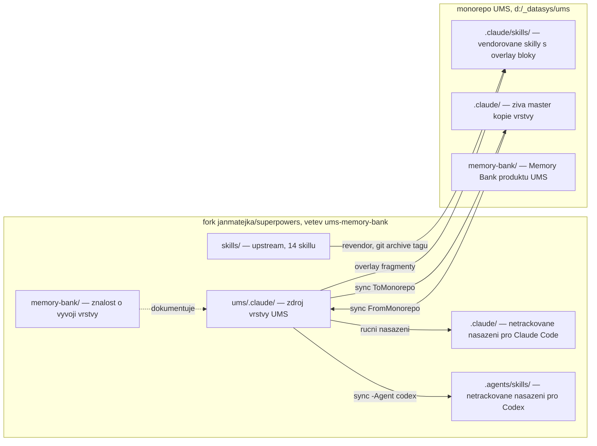
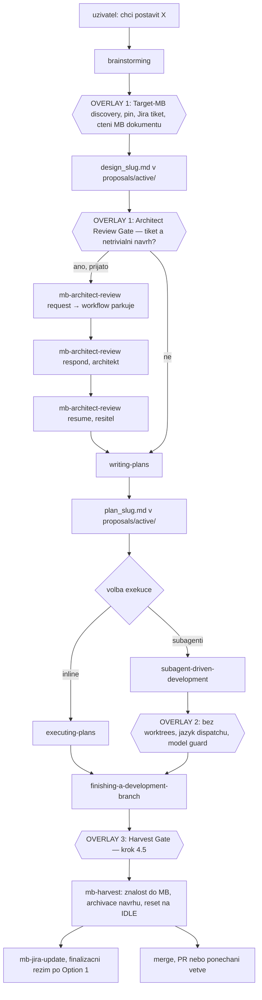
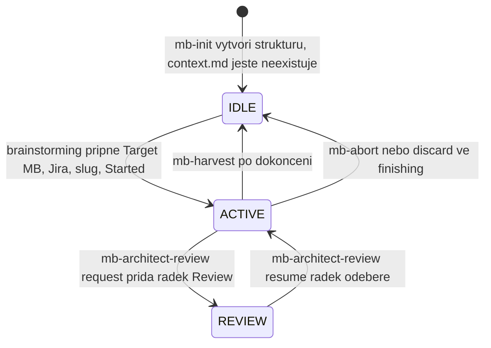
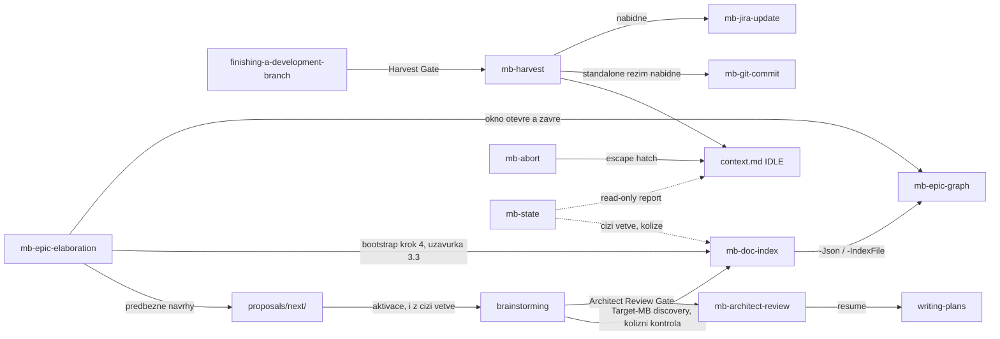
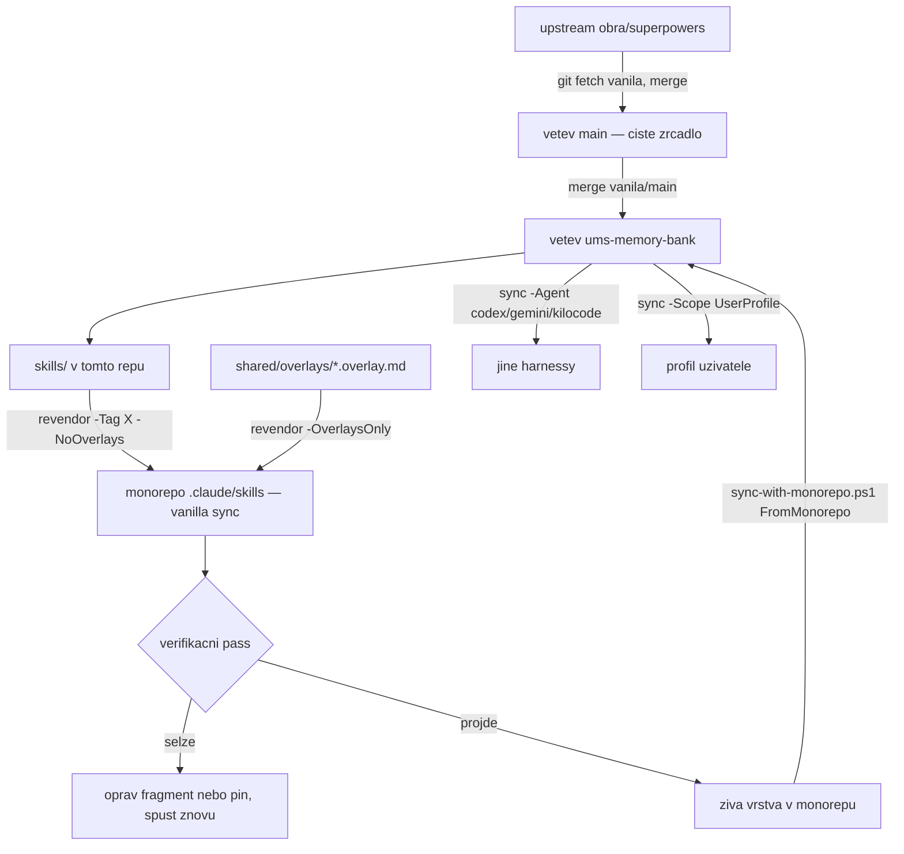

# Architecture

Dokument mapuje tři věci: **z čeho se repozitář skládá**, **jak spolupracuje
workflow Superpowers s vrstvou UMS**, a **jak se vrstva dostane od zdroje
k uživateli**.

## 1. Vrstvy a jejich hranice

| Vrstva | Kde žije | Kdo ji mění |
|---|---|---|
| Upstream skill pack | [`skills/`](../skills/) — 14 skillů | jen upstream (`vanila/main` → `main`) |
| Upstream infrastruktura | [`hooks/`](../hooks/), [`tests/`](../tests/), [`docs/`](../docs/), `.opencode/`, `.pi/`, `.claude-plugin/`, … | jen upstream |
| Normativní zdroj UMS | [`ums/.claude/skills/shared/`](../ums/.claude/skills/shared/) — kontrakt v2.2, manifest, vendor pin, overlay fragmenty | tato větev |
| Utility skilly UMS | [`ums/.claude/skills/mb-*/`](../ums/.claude/skills/) | tato větev |
| Lepidlo pro Claude Code | [`ums/.claude/settings.json`](../ums/.claude/settings.json), [`ums/.claude/hooks/`](../ums/.claude/hooks/) | tato větev |
| Nástroje | [`ums/sync-with-monorepo.ps1`](../ums/sync-with-monorepo.ps1), [`ums/.claude/scripts/revendor-superpowers.ps1`](../ums/.claude/scripts/) | tato větev |
| Znalost o vývoji vrstvy | [`memory-bank/`](.) | tato větev |

**Klíčová hranice:** overlay se nikdy neaplikuje na `skills/` v tomto repu.
Vendorované kopie s overlay bloky vznikají teprve v cíli nasazení (monorepo,
profil uživatele, lokální `.claude/` tohoto repa). Zdrojový `skills/` zůstává
byte-identický s upstreamem, proto je merge upstreamu vždy bezkonfliktní.

Nasazené kopie v tomto repu (`.claude/`, `.agents/skills/`) jsou **netrackované**
(upstream `.gitignore` ignoruje každý `.claude/`) a mohou být za zdrojem —
autoritou je vždy `ums/.claude/`. Sezení v tomto repu ale běží nad nasazenou
kopií, takže po změně zdroje je nutné nasazení obnovit, jinak agent pracuje se
starou verzí vrstvy.

## 2. Workflow Superpowers a body zásahu UMS

Superpowers řídí životní cyklus práce. UMS do něj vstupuje **přesně třemi
overlay bloky** plus sadou skillů volaných z těchto bloků.

### Overlay 1 — `brainstorming`

Fragment [`brainstorming.overlay.md`](../ums/.claude/skills/shared/overlays/brainstorming.overlay.md),
ukotvený na konec souboru. Mění tři body upstream checklistu:

- **Bod 1 (Explore project context)** navíc spouští **Target-MB discovery**:
  najít cílovou Memory Bank (lokální sken sloučený s indexem skillu
  [`mb-doc-index`](../ums/.claude/skills/mb-doc-index/) nad `origin` —
  model tahu, kandidáti napříč větvemi), aktivovat případný předběžný návrh
  z `proposals/next/` (i na cizí větvi — převzetí je kopie blobu, viz sekce
  3), zeptat se na Jira tiket, poté **znovu spustit index s deklarovaným
  záměrem** (`-Jira`/`-Slug`) pro meziclonovou kolizní kontrolu — nález
  `KOLIZE AKTIVNÍ PRÁCE` je fail-closed stop, cizí aktivní práce jiných
  tiketů je jen informace — zapsat `Target MB Pin`, `Jira`, `Work item`
  a `Started` do `context.md`, přečíst dokumenty cílové MB jako kontext
  návrhu.
- **Bod 6 (Write design doc)** přesměruje uložení z upstream cesty
  `docs/superpowers/specs/` na `<PLAN_MB>/proposals/active/design_<slug>.md`
  (česky, s hlavičkou dle kontraktu) a vyžaduje větev na místě místo worktree;
  po commitu návrhu následuje publikace vlastní tiketové větve (publikační bod
  1, sekce 3).
- **Architect Review Gate** mezi body 8 a 9: s navázaným tiketem se VŽDY nabídne
  design review architektem. Přijetí znamená konec workflow v tomto sezení —
  pokračuje se až režimem resume.

### Overlay 2 — `subagent-driven-development`

Fragment [`subagent-driven-development.overlay.md`](../ums/.claude/skills/shared/overlays/subagent-driven-development.overlay.md),
na konec souboru. Nemění smyčku tasků, jen tři pravidla:

- **model** — platí upstream Model Selection; UMS jen požaduje explicitní model
  u každého dispatche a nejlevnější tier pro čistě summarizační práci,
- **jazyk** — dispatch prompty, briefy, reporty a ledger anglicky, commit
  messages implementátorů a výstupy pro uživatele česky,
- **izolace** — worktrees zakázané, krok `using-git-worktrees` se řeší jako
  větev na místě,
- **publikace** — před dispatchem prvního tasku se publikuje vlastní větev
  s commitnutým plánem (publikační bod 2, sekce 3), vedle baseline
  build/test kontroly.

### Overlay 3 — `finishing-a-development-branch`

Fragment [`finishing-a-development-branch.overlay.md`](../ums/.claude/skills/shared/overlays/finishing-a-development-branch.overlay.md),
vložený **před** řádek `## Step 5: Execute Choice` — jediný fragment s
kotvou `ANCHOR-BEFORE`, tedy jediný citlivý na drift upstreamu. Přidává krok
4.5:

- u všech tří variant (merge / PR / ponechat) nejprve `mb-harvest`, pak commit
  MB změn, teprve potom vlastní varianta,
- u varianty 1 se místo upstream `git pull` nabídne fetch + fast-forward
  lokálního `develop`; merge je `--no-ff`,
- po zeleném merge varianty 1 se nabídne publikace `develop` na `origin`
  (příkaz s lidskou výjimkou `UMS_ALLOW_SHARED_PUSH=1`, agent nikdy nepushuje
  sdílenou větev sám ani si výjimku nenastavuje — sekce 3); dokud `develop`
  není publikovaný, finalizace `mb-jira-update` se zastaví na vlastní bráně
  dosažitelnosti a tiket nepřejde do „Test",
- po úspěšné variantě 1 s tiketem `mb-jira-update` ve finalizačním režimu
  (tiket přechází přímo do „Test", ruší se Flagged),
- discard cesta neharvestuje: pár jde do `proposals/abandoned/` a `context.md`
  se resetuje.

### Co Superpowers vlastní bez zásahu UMS

Smyčku tasků SDD (implementátor → task review → fix loop max 5 kol → adjudikace
na stropu), pracovní adresář plánu `.superpowers/sdd/<plan-basename>/` s
ledgerem `progress.md`, finální whole-branch review, volbu modelu, pravidla TDD
a systematického debuggingu. Kontrakt tento scratch tree explicitně vyjímá ze
scope locku Memory Bank.

## 3. Publikace a viditelnost napříč větvemi

Aktéři pracují každý ve svém clonu a tiketové větvi a nevidí se navzájem,
dokud se něco nesloučí. Vrstva to řeší modelem tahu (dokumenty se hledají, ne
tlačí) a publikačním invariantem (co se zveřejní, musí být dosažitelné).
Normativní zdroj: kontrakt v2.2, sekce **Publication Contract** a
**Cross-Branch Visibility**.

### Model tahu — `mb-doc-index`

[`mb-doc-index`](../ums/.claude/skills/mb-doc-index/) (sourozenec
`mb-epic-graph`, čistě read-only) indexuje dokumenty napříč větvemi na
`origin`: jeden traversal historie vzdálených větví
([`doc-index.ps1`](../ums/.claude/skills/mb-doc-index/scripts/doc-index.ps1),
`git log --remotes=origin`), omezený cestou, časem (`-SinceDays`) i bází
(`-BaseRef`), sloučený s lokálním working tree (pseudo-větev `local`, jeden
`git ls-files --cached --others --exclude-standard`, bez rekurzivního
průchodu adresářů) a s obsahem báze (pseudo-větev `base`) do jednoho indexu.
Výstup je česká tabulka pro člověka plus `-Json <path>` pro strojové
konzumenty (Target-MB discovery, `mb-epic-graph -IndexFile`,
`mb-epic-elaboration` bootstrap). Nálezy jsou rozhodovací kandidáti pro
člověka, ne automatické opravy: `KOLIZE AKTIVNÍ PRÁCE` (stejný slug/tiket
aktivní na cizí větvi — CHYBA, exit 2, zastavuje pinování nové práce),
`DRAFT NA VÍCE VĚTVÍCH`, `FRONTA I DOKONČENO` (VAROVÁNÍ), `CIZÍ AKTIVNÍ
PRÁCE` (normální paralelní provoz jiných tiketů, jen informace, exit 0).
`KOLIZE AKTIVNÍ PRÁCE` funguje i s prázdnou lokální množinou (discovery běží
dřív, než návrhový dokument vznikne) jen s **deklarovaným záměrem**
(`-Jira`/`-Slug`); bez něj degraduje na `CIZÍ AKTIVNÍ PRÁCE` a nezastaví nic.

Převzetí draftu z cizí větve je **kopie blobu** (`git show <ref>:<path> >
<path>`), nikdy cherry-pick — elaborační okno se zavírá jedním commitem
nesoucím ledger i všechny proposaly okna, takže cherry-pick by přitáhl cizí
ledger. Převzatý dokument nese v hlavičce `**Převzato z:** <branch>@<sha>`.
Tiketová větev se zakládá vždy z **aktuální** báze (fetch + fast-forward),
jinak nevidí ani mergnuté plánování. Obživlá fronta (originál draftu zůstane
v `next/` na zdrojové větvi a znovu se objeví v bázi po jejím mergi) je
detekovaná (`mb-doc-index`, `mb-epic-graph -Check`), ne bráněná — úklid je
jeden `git rm`.

### Publikační invariant a dvouúrovňová push policy

**Žádná reference bez dosažitelnosti:** kdykoli vrstva pojmenuje git objekt
mimo clon (odkaz v popisu/komentáři tiketu, tabulka vln, předávací komentář,
ledger), pinovaný commit musí být v tu chvíli dosažitelný na `origin`
(`git fetch origin` + `git branch -r --contains <sha>`); nedosažitelnost je
fail-closed stop, ne varování. Čtyři publikační body: po commitu návrhu
(brainstorming), po commitu plánu před dispatchem prvního tasku (SDD), při
uzávěrce elaboračního okna před zápisem odkazů do Jiry, před každým
handoffem (design review je referenční implementace).

| Úroveň | Pravidlo |
|---|---|
| Vlastní tiketová větev (nechráněná) | Agent pushuje sám a vždy ohlásí větev a odchozí commity — publikace vlastní větve je oznámení, ne otázka k rozhodnutí. Force push zakázán. |
| Sdílené větve (`develop`, `main`, `master`, `release/*`) | Agent nepushuje nikdy. Připraví přesný příkaz s výčtem commitů; uživatel ho schválí nebo spustí sám (`! UMS_ALLOW_SHARED_PUSH=1 git push origin develop`). Agent poté znovu ověří dosažitelnost. |

`UMS_ALLOW_SHARED_PUSH=1` je lidská úniková cesta: git hook nepozná člověka
od agenta, takže bez explicitní výjimky by pravidlo o sdílených větvích bylo
neproveditelné (vrstva podá uživateli příkaz a její vlastní hook by ho
zamítl). Zvedá jen tohle jedno pravidlo — mazání větve a force push zůstávají
zakázané i s ní. Výjimka patří **člověku; agent ji nikdy nenastavuje**.

### Dvouvrstvá mechanika vynucení

Skutečnou hranicí je git `pre-push` hook
([`ums/.claude/hooks/pre-push`](../ums/.claude/hooks/pre-push), POSIX `sh`,
bez přípony) — git mu předá už rozparsované čtveřice `<local-ref> <local-sha>
<remote-ref> <remote-sha>`, takže neexistuje shellové parsování k obejití.
Zamítá: chráněný cílový ref (s výjimkou `UMS_ALLOW_SHARED_PUSH=1`), mazání
větve a non-fast-forward (force) push; scope je `refs/heads/*`, tagy
procházejí vždy. `--no-verify` ho obchází a `core.hooksPath` ho může
přesměrovat jinam (relativní hodnota per-worktree) — proto ho instaluje
per-clone [`install-git-hooks.ps1`](../ums/.claude/hooks/install-git-hooks.ps1)
(cíl řeší přes `git rev-parse --git-path hooks/pre-push`, tedy správně i pro
linked worktree a `core.hooksPath`; dvoukolovým sebetestem ověřuje, že
nainstalovaný hook skutečně zamítá i propouští, ne jen jedno z toho), volané
i ze [`sync-with-monorepo.ps1`](../ums/sync-with-monorepo.ps1) při `-Scope
Monorepo` pro libovolného `-Agent`.

Vedle něj běží `guard-git-push.mjs` jako PreToolUse hook — **demotovaný**
z původní role bezpečnostní hranice na fail-open rychlé varování. Dvě kola
review experimentálně prokázala, že parsování shellového příkazu hranicí být
nemůže: deny-listem i allowlistem s vlastním tokenizerem šly obejít reálné
tvary pushe do chráněné větve. Co bezpečně rozparsuje jako push do chráněné
větve nebo `--no-verify`, zamítne hned a česky; čemu nerozumí, propustí —
skutečným backstopem zůstává ochrana větví na serveru.

Zapojení do zbytku vrstvy: `mb-jira-update` §6b ověřuje dosažitelnost před
zápisem odkazu do Jiry a §10 (finalizační režim) před přechodem tiketu do
„Testu"; overlay `finishing-a-development-branch` nabízí publikaci `develop`
po Option 1 (výše); overlay `subagent-driven-development` publikuje plán
před prvním dispatchem; `mb-architect-review` krok 4 (handoff push) odkazuje
na tento invariant místo vlastního pravidla.

## 4. Dokumentová vrstva

Normativní zdroj: [kontrakt v2.2](../ums/.claude/skills/shared/UMS_MEMORY_BANK_CONTRACT.md).

**Trojvrstvý model adresářů**

| Pojem | Definice | V tomto repu |
|---|---|---|
| `MB_ROOT` | `git rev-parse --show-toplevel` — jediný discovery krok | kořen forku |
| `CTX_DIR` | `<MB_ROOT>/memory-bank/` — orchestrační kořen, drží `context.md` | [`memory-bank/`](.) |
| `PLAN_MB` | `<MB_ROOT>/<Target MB Pin>` — MB, kterou práce cílí | `memory-bank/` (práce je repo-wide) |
| `AFFECTED_MBS` | MB dotčené harvestem, derivované z diffu větve | v tomto repu vždy `memory-bank/` |

**Pracovní položka** = pár `design_<slug>.md` (návrh, píše brainstorming) +
`plan_<slug>.md` (plán, píše writing-plans) v `proposals/active/`. Jedna aktivní
položka na repozitář; druhý aktivní slug je fail-closed stop. Slug začíná kódem
tiketu, když je znám (`ums_3361_design_review_workflow`).

**Archivační asymetrie:** dokončení uchová jen návrh v `proposals/completed/`
a plán **smaže** (jeho kroky jsou vyčerpané, výsledek nese kód, git historie
a aktualizované MB dokumenty). Opuštění přesune **oba** soubory do
`proposals/abandoned/` a nemaže nic.

**Předběžné položky** čekají jako samostatné `design_<slug>.md` v
`proposals/next/`; nezapočítávají se do limitu aktivních prací a aktivují se
přesunem do `active/` při Target-MB discovery.

**Grandfather:** starší pojmenování `proposal_<slug>-design.md` /
`proposal_<slug>.md` zůstává platné všude, kde leží; nepřejmenovává se, jedinou
výjimkou je aktivace předběžného návrhu z `next/`.

**Stav v `context.md`**

Zapisovatelé `context.md` jsou právě tři: řídící sezení při Target-MB discovery,
`mb-harvest` / `mb-abort` (reset na IDLE) a `mb-architect-review` (jen řádek
`Review:`). Dokud řádek `Review:` existuje, writing-plans se nesmí spustit.

**Harvest style je závazně „current-state":** MB dokumenty popisují přítomný
stav jako referenční dokumentace. Datované changelogové sekce („Nedávné změny",
„Recent Changes") jsou zakázané — historie žije v `proposals/completed/` a
v gitu.

## 5. Skilly UMS a jejich vazby

| Skill | Role | Volán odkud |
|---|---|---|
| `mb-init` | Vytvoří strukturu `memory-bank/` — režim orchestračního kořene nebo projektové MB. Nikdy netvoří `context.md`. | ručně |
| `mb-state` | Read-only stav: pin, slug, úplnost páru, SDD ledger, větev, staleness. | ručně |
| `mb-harvest` | Složí znalost do dotčených MB, archivuje návrh, smaže plán, resetuje na IDLE. Zákaz git operací — commit vlastní volající. | Harvest Gate ve finishing, nebo ručně |
| `mb-abort` | Opuštění práce: pár do `abandoned/`, reset na IDLE. Kód nevrací. | ručně |
| `mb-architect-review` | Design review živým architektem přes tiket: request / respond / resume, branch sync dle tiketu, publikace vlastní větve dle Publication Contract (ohlášená, ne na souhlas). | Architect Review Gate, nebo ručně |
| `mb-jira-update` | České shrnutí implementace do Jira; brána dosažitelnosti (§6b) před zápisem odkazu; finalizační režim posune tiket do „Test" jen po publikaci merge commitu. | z `mb-harvest`, z finishing, nebo ručně |
| `mb-git-message` / `mb-git-commit` | Návrh commit message / scoped commit. Nikdy nepushují. | ručně, z `mb-harvest` |
| `mb-sync` | Dosynchronizuje MB dokumenty s realitou kódu mimo workflow. | ručně |
| `mb-scan` | Read-only hloubková analýza projektu. | ručně |
| `mb-epic-elaboration` | Iterativní rozpracování epiku po ohraničených oknech: evidence ledger, dirty-set, invarianty, předběžné návrhy do `next/`. | ručně |
| `mb-epic-graph` | Graf závislostí epiku z Jira linků nebo z hlaviček návrhů, plus orákulum konzistence text ↔ linky a `-IndexFile` findings o cizích větvích. Read-only skript. | z `mb-epic-elaboration`, nebo ručně |
| `mb-doc-index` | Read-only index MB dokumentů napříč větvemi `origin` (model tahu); kolizní findings pro discovery, elaboraci i `mb-state`. | z brainstormingu (discovery), z `mb-epic-elaboration`, z `mb-state`, nebo ručně |
| `mb-plan`, `mb-act` | Deprecated stuby v1 — jen přesměrují na Superpowers workflow. | zpětná kompatibilita |

Nástroje s vlastním kódem a testy: `mb-epic-graph`
([`epic-graph.ps1`](../ums/.claude/skills/mb-epic-graph/scripts/epic-graph.ps1) —
generování grafu, vlny, rozhodovací stavové ikony, strukturální i prose
orákulum), `mb-epic-elaboration`
([`ledger-status.ps1`](../ums/.claude/skills/mb-epic-elaboration/scripts/ledger-status.ps1))
a `mb-doc-index`
([`doc-index.ps1`](../ums/.claude/skills/mb-doc-index/scripts/doc-index.ps1) —
traversal historie vzdálených větví, enumerace, findings). Ostatní `mb-*`
skilly jsou čistě instrukční Markdown.

## 6. Vendoring a nasazení

Pipeline má dvě fáze. **Vendoring** vyrábí kopie upstream skillů s overlay
bloky, a to až v cíli nasazení (klíčová hranice, sekce 1); jeho výstup propouští
až verifikační pass. **Sync vrstvy** (`sync-with-monorepo.ps1`) rozváží vrstvu
samotnou; cíle popisuje tabulka `$AgentTargets` — skills dir / config dir /
instrukční soubor pro `claude`, `codex`, `gemini`, `kilocode` × `Monorepo`,
`UserProfile`.

Příkazy obou fází, jejich pořadí i pravidla o tom, co se kam nenasazuje, jsou
v [playbook.md](playbook.md).

## 7. Invarianty, na kterých vrstva stojí

1. **Aditivnost.** Mimo `ums/` (plus `CLAUDE.md` sekci a `memory-bank/`) se na
   této větvi nic nemění → upstream merge nikdy nekonfliktuje.
2. **Jeden normativní zdroj.** Pravidla jsou v kontraktu; skilly a overlaye na
   něj odkazují. Změna pravidla začíná v kontraktu.
3. **Fail-closed.** Chybějící git, chybějící `memory-bank/`, nedefinovaný
   `PLAN_MB` v okamžiku zápisu návrhu, nejednoznačná cílová MB, druhý aktivní
   slug — vždy zastavit, nikdy neuhádnout.
4. **Superpowers řídí, MB dokumentuje.** UMS nepřebírá exekuci ani volbu modelu.
5. **Bez worktrees.** Izolace = větev na místě.
6. **Dvouúrovňová publikace, žádná tichá sdílená větev.** Vlastní tiketovou
   větev agent pushuje sám a vždy ohlásí; sdílené větve (`develop`, `main`,
   `master`, `release/*`) nepushuje nikdy — připraví příkaz a čeká na
   uživatele (lidská výjimka `UMS_ALLOW_SHARED_PUSH=1`). Vynucuje git
   `pre-push` hook, viz sekce 3.
7. **Jazykový kontrakt.** Trvalé a uživatelské texty česky, AI-facing anglicky
   (vývojářské nástroje vrstvy — `install-git-hooks.ps1`,
   `sync-with-monorepo.ps1`, `revendor-superpowers.ps1` — jsou výjimkou a
   mluví anglicky jako kód kolem nich).

## 8. Specifika Memory Bank tohoto repozitáře

- `memory-bank/` plní současně roli `CTX_DIR` i `PLAN_MB` — repozitář je jeden
  projekt (vrstva UMS) a práce na něm je repo-wide, takže se `Target MB Pin`
  legitimně ukazuje na orchestrační kořen.
- Před zavedením této Memory Bank se páry návrh + plán odkládaly do
  `ums/docs/`; jejich hlavičky proto nesou historickou poznámku, že fork Memory
  Bank nemá. Dokončené návrhy jsou archivované v
  [proposals/completed/](proposals/completed/) v původní podobě.
- Memory Bank produktu UMS (`d:\_datasys\ums\memory-bank\`) je jiná Memory Bank
  — dokumentuje produkt, na kterém se vrstva používá. Tato dokumentuje vývoj
  vrstvy samotné.
