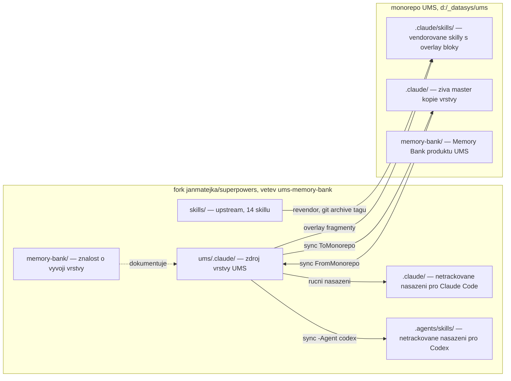
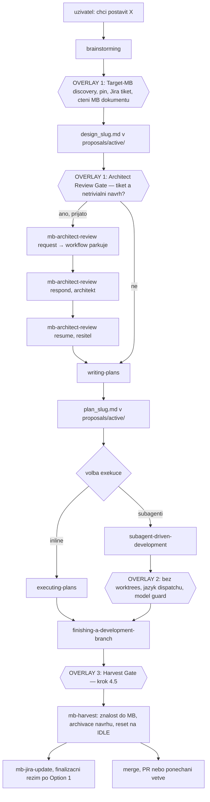
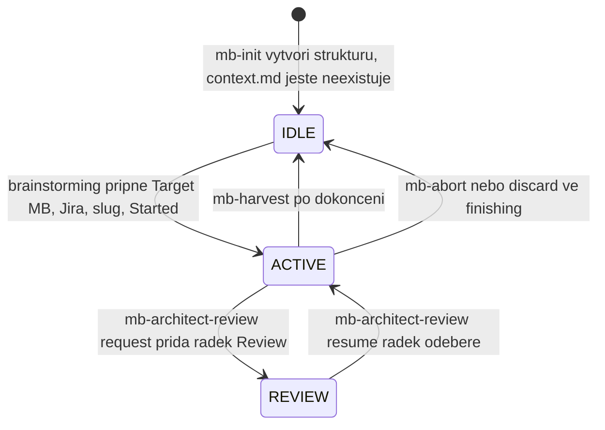
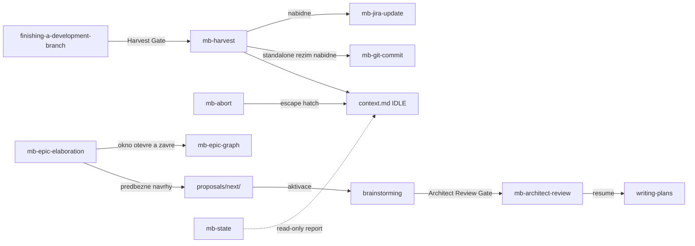
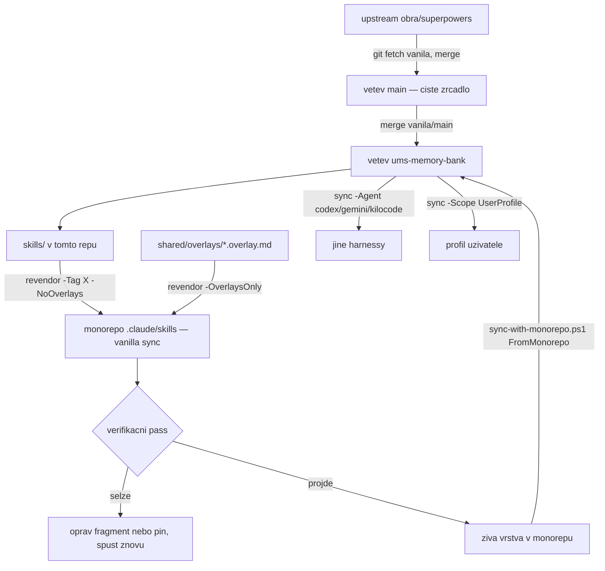

# Architecture

Dokument mapuje tři věci: **z čeho se repozitář skládá**, **jak spolupracuje
workflow Superpowers s vrstvou UMS**, a **jak se vrstva dostane od zdroje
k uživateli**.

## 1. Vrstvy a jejich hranice

| Vrstva | Kde žije | Kdo ji mění |
|---|---|---|
| Upstream skill pack | [`skills/`](../skills/) — 14 skillů | jen upstream (`vanila/main` → `main`) |
| Upstream infrastruktura | [`hooks/`](../hooks/), [`tests/`](../tests/), [`docs/`](../docs/), `.opencode/`, `.pi/`, `.claude-plugin/`, … | jen upstream |
| Normativní zdroj UMS | [`ums/.claude/skills/shared/`](../ums/.claude/skills/shared/) — kontrakt v2.1, manifest, vendor pin, overlay fragmenty | tato větev |
| Utility skilly UMS | [`ums/.claude/skills/mb-*/`](../ums/.claude/skills/) | tato větev |
| Lepidlo pro Claude Code | [`ums/.claude/settings.json`](../ums/.claude/settings.json), [`ums/.claude/hooks/`](../ums/.claude/hooks/) | tato větev |
| Nástroje | [`ums/sync-with-monorepo.ps1`](../ums/sync-with-monorepo.ps1), [`ums/.claude/scripts/revendor-superpowers.ps1`](../ums/.claude/scripts/) | tato větev |
| Znalost o vývoji vrstvy | [`memory-bank/`](.) | tato větev |

**Klíčová hranice:** overlay se nikdy neaplikuje na `skills/` v tomto repu.
Vendorované kopie s overlay bloky vznikají teprve v cíli nasazení (monorepo,
profil uživatele, lokální `.claude/` tohoto repa). Zdrojový `skills/` zůstává
byte-identický s upstreamem, proto je merge upstreamu vždy bezkonfliktní.

Nasazené kopie v tomto repu (`.claude/`, `.agents/skills/`) jsou **netrackované**
(upstream `.gitignore` ignoruje každý `.claude/`) a mohou být za zdrojem —
autoritou je vždy `ums/.claude/`. Sezení v tomto repu ale běží nad nasazenou
kopií, takže po změně zdroje je nutné nasazení obnovit, jinak agent pracuje se
starou verzí vrstvy.

## 2. Workflow Superpowers a body zásahu UMS

Superpowers řídí životní cyklus práce. UMS do něj vstupuje **přesně třemi
overlay bloky** plus sadou skillů volaných z těchto bloků.

### Overlay 1 — `brainstorming`

Fragment [`brainstorming.overlay.md`](../ums/.claude/skills/shared/overlays/brainstorming.overlay.md),
ukotvený na konec souboru. Mění tři body upstream checklistu:

- **Bod 1 (Explore project context)** navíc spouští **Target-MB discovery**:
  najít cílovou Memory Bank, aktivovat případný předběžný návrh z
  `proposals/next/`, zeptat se na Jira tiket, zapsat `Target MB Pin`, `Jira`,
  `Work item` a `Started` do `context.md`, přečíst dokumenty cílové MB jako
  kontext návrhu.
- **Bod 6 (Write design doc)** přesměruje uložení z upstream cesty
  `docs/superpowers/specs/` na `<PLAN_MB>/proposals/active/design_<slug>.md`
  (česky, s hlavičkou dle kontraktu) a vyžaduje větev na místě místo worktree.
- **Architect Review Gate** mezi body 8 a 9: s navázaným tiketem se VŽDY nabídne
  design review architektem. Přijetí znamená konec workflow v tomto sezení —
  pokračuje se až režimem resume.

### Overlay 2 — `subagent-driven-development`

Fragment [`subagent-driven-development.overlay.md`](../ums/.claude/skills/shared/overlays/subagent-driven-development.overlay.md),
na konec souboru. Nemění smyčku tasků, jen tři pravidla:

- **model** — platí upstream Model Selection; UMS jen požaduje explicitní model
  u každého dispatche a nejlevnější tier pro čistě summarizační práci,
- **jazyk** — dispatch prompty, briefy, reporty a ledger anglicky, commit
  messages implementátorů a výstupy pro uživatele česky,
- **izolace** — worktrees zakázané, krok `using-git-worktrees` se řeší jako
  větev na místě.

### Overlay 3 — `finishing-a-development-branch`

Fragment [`finishing-a-development-branch.overlay.md`](../ums/.claude/skills/shared/overlays/finishing-a-development-branch.overlay.md),
vložený **před** řádek `## Step 5: Execute Choice` — jediný fragment s
kotvou `ANCHOR-BEFORE`, tedy jediný citlivý na drift upstreamu. Přidává krok
4.5:

- u všech tří variant (merge / PR / ponechat) nejprve `mb-harvest`, pak commit
  MB změn, teprve potom vlastní varianta,
- u varianty 1 se místo upstream `git pull` nabídne fetch + fast-forward
  lokálního `develop`; merge je `--no-ff`,
- po úspěšné variantě 1 s tiketem `mb-jira-update` ve finalizačním režimu
  (tiket přechází přímo do „Test", ruší se Flagged),
- discard cesta neharvestuje: pár jde do `proposals/abandoned/` a `context.md`
  se resetuje.

### Co Superpowers vlastní bez zásahu UMS

Smyčku tasků SDD (implementátor → task review → fix loop max 5 kol → adjudikace
na stropu), pracovní adresář plánu `.superpowers/sdd/<plan-basename>/` s
ledgerem `progress.md`, finální whole-branch review, volbu modelu, pravidla TDD
a systematického debuggingu. Kontrakt tento scratch tree explicitně vyjímá ze
scope locku Memory Bank.

## 3. Dokumentová vrstva

Normativní zdroj: [kontrakt v2.1](../ums/.claude/skills/shared/UMS_MEMORY_BANK_CONTRACT.md).

**Trojvrstvý model adresářů**

| Pojem | Definice | V tomto repu |
|---|---|---|
| `MB_ROOT` | `git rev-parse --show-toplevel` — jediný discovery krok | kořen forku |
| `CTX_DIR` | `<MB_ROOT>/memory-bank/` — orchestrační kořen, drží `context.md` | [`memory-bank/`](.) |
| `PLAN_MB` | `<MB_ROOT>/<Target MB Pin>` — MB, kterou práce cílí | `memory-bank/` (práce je repo-wide) |
| `AFFECTED_MBS` | MB dotčené harvestem, derivované z diffu větve | v tomto repu vždy `memory-bank/` |

**Pracovní položka** = pár `design_<slug>.md` (návrh, píše brainstorming) +
`plan_<slug>.md` (plán, píše writing-plans) v `proposals/active/`. Jedna aktivní
položka na repozitář; druhý aktivní slug je fail-closed stop. Slug začíná kódem
tiketu, když je znám (`ums_3361_design_review_workflow`).

**Archivační asymetrie:** dokončení uchová jen návrh v `proposals/completed/`
a plán **smaže** (jeho kroky jsou vyčerpané, výsledek nese kód, git historie
a aktualizované MB dokumenty). Opuštění přesune **oba** soubory do
`proposals/abandoned/` a nemaže nic.

**Předběžné položky** čekají jako samostatné `design_<slug>.md` v
`proposals/next/`; nezapočítávají se do limitu aktivních prací a aktivují se
přesunem do `active/` při Target-MB discovery.

**Grandfather:** starší pojmenování `proposal_<slug>-design.md` /
`proposal_<slug>.md` zůstává platné všude, kde leží; nepřejmenovává se, jedinou
výjimkou je aktivace předběžného návrhu z `next/`.

**Stav v `context.md`**

Zapisovatelé `context.md` jsou právě tři: řídící sezení při Target-MB discovery,
`mb-harvest` / `mb-abort` (reset na IDLE) a `mb-architect-review` (jen řádek
`Review:`). Dokud řádek `Review:` existuje, writing-plans se nesmí spustit.

**Harvest style je závazně „current-state":** MB dokumenty popisují přítomný
stav jako referenční dokumentace. Datované changelogové sekce („Nedávné změny",
„Recent Changes") jsou zakázané — historie žije v `proposals/completed/` a
v gitu.

## 4. Skilly UMS a jejich vazby

| Skill | Role | Volán odkud |
|---|---|---|
| `mb-init` | Vytvoří strukturu `memory-bank/` — režim orchestračního kořene nebo projektové MB. Nikdy netvoří `context.md`. | ručně |
| `mb-state` | Read-only stav: pin, slug, úplnost páru, SDD ledger, větev, staleness. | ručně |
| `mb-harvest` | Složí znalost do dotčených MB, archivuje návrh, smaže plán, resetuje na IDLE. Zákaz git operací — commit vlastní volající. | Harvest Gate ve finishing, nebo ručně |
| `mb-abort` | Opuštění práce: pár do `abandoned/`, reset na IDLE. Kód nevrací. | ručně |
| `mb-architect-review` | Design review živým architektem přes tiket: request / respond / resume, branch sync dle tiketu, push jen se souhlasem. | Architect Review Gate, nebo ručně |
| `mb-jira-update` | České shrnutí implementace do Jira; finalizační režim posune tiket do „Test". | z `mb-harvest`, z finishing, nebo ručně |
| `mb-git-message` / `mb-git-commit` | Návrh commit message / scoped commit. Nikdy nepushují. | ručně, z `mb-harvest` |
| `mb-sync` | Dosynchronizuje MB dokumenty s realitou kódu mimo workflow. | ručně |
| `mb-scan` | Read-only hloubková analýza projektu. | ručně |
| `mb-epic-elaboration` | Iterativní rozpracování epiku po ohraničených oknech: evidence ledger, dirty-set, invarianty, předběžné návrhy do `next/`. | ručně |
| `mb-epic-graph` | Graf závislostí epiku z Jira linků nebo z hlaviček návrhů, plus orákulum konzistence text ↔ linky. Read-only skript. | z `mb-epic-elaboration`, nebo ručně |
| `mb-plan`, `mb-act` | Deprecated stuby v1 — jen přesměrují na Superpowers workflow. | zpětná kompatibilita |

Nástroje s vlastním kódem a testy: `mb-epic-graph`
([`epic-graph.ps1`](../ums/.claude/skills/mb-epic-graph/scripts/epic-graph.ps1) —
generování grafu, vlny, rozhodovací stavové ikony, strukturální i prose
orákulum) a `mb-epic-elaboration`
([`ledger-status.ps1`](../ums/.claude/skills/mb-epic-elaboration/scripts/ledger-status.ps1)).
Ostatní `mb-*` skilly jsou čistě instrukční Markdown.

## 5. Vendoring a nasazení

**Dvoucommitový vzor upgradu upstreamu** (běží v monorepu):

1. `revendor-superpowers.ps1 -Tag <nový> -NoOverlays` → commit „vanilla sync",
2. `revendor-superpowers.ps1 -OverlaysOnly` → commit „overlay".

Vendorované soubory se **nikdy** needitují ručně mimo bloky
`<!-- UMS-OVERLAY BEGIN/END -->`; mění se fragment a aplikuje se znovu. Miss
kotvy `ANCHOR-BEFORE` je detektor driftu upstreamu — vypíše přesně fragmenty,
které potřebují lidský zásah.

**Sync vrstvy** (`sync-with-monorepo.ps1`): pro `claude` + `Monorepo`
dvousměrně (`-Direction FromMonorepo|ToMonorepo`), jinak jednosměrný deploy.
Cíle jsou tabulka `$AgentTargets` (skills dir / config dir / instrukční soubor
pro `claude`, `codex`, `gemini`, `kilocode` × `Monorepo`, `UserProfile`).
`settings.json` se na ne-Claude cíle záměrně nenasazuje; glue soubory se
merguji bez mazání cizího obsahu; blok preferencí se do instrukčního souboru
vkládá mezi markery `UMS-MEMORY-BANK BEGIN/END`, takže re-run blok nahradí na
místě.

## 6. Invarianty, na kterých vrstva stojí

1. **Aditivnost.** Mimo `ums/` (plus `CLAUDE.md` sekci a `memory-bank/`) se na
   této větvi nic nemění → upstream merge nikdy nekonfliktuje.
2. **Jeden normativní zdroj.** Pravidla jsou v kontraktu; skilly a overlaye na
   něj odkazují. Změna pravidla začíná v kontraktu.
3. **Fail-closed.** Chybějící git, chybějící `memory-bank/`, nedefinovaný
   `PLAN_MB` v okamžiku zápisu návrhu, nejednoznačná cílová MB, druhý aktivní
   slug — vždy zastavit, nikdy neuhádnout.
4. **Superpowers řídí, MB dokumentuje.** UMS nepřebírá exekuci ani volbu modelu.
5. **Bez worktrees.** Izolace = větev na místě.
6. **Push nikdy tiše.** Každý push je nabídka čekající na potvrzení.
7. **Jazykový kontrakt.** Trvalé a uživatelské texty česky, AI-facing anglicky.

## 7. Specifika Memory Bank tohoto repozitáře

- `memory-bank/` plní současně roli `CTX_DIR` i `PLAN_MB` — repozitář je jeden
  projekt (vrstva UMS) a práce na něm je repo-wide, takže se `Target MB Pin`
  legitimně ukazuje na orchestrační kořen.
- Před zavedením této Memory Bank se páry návrh + plán odkládaly do
  `ums/docs/`; jejich hlavičky proto nesou historickou poznámku, že fork Memory
  Bank nemá. Dokončené návrhy jsou archivované v
  [proposals/completed/](proposals/completed/) v původní podobě.
- Memory Bank produktu UMS (`d:\_datasys\ums\memory-bank\`) je jiná Memory Bank
  — dokumentuje produkt, na kterém se vrstva používá. Tato dokumentuje vývoj
  vrstvy samotné.
