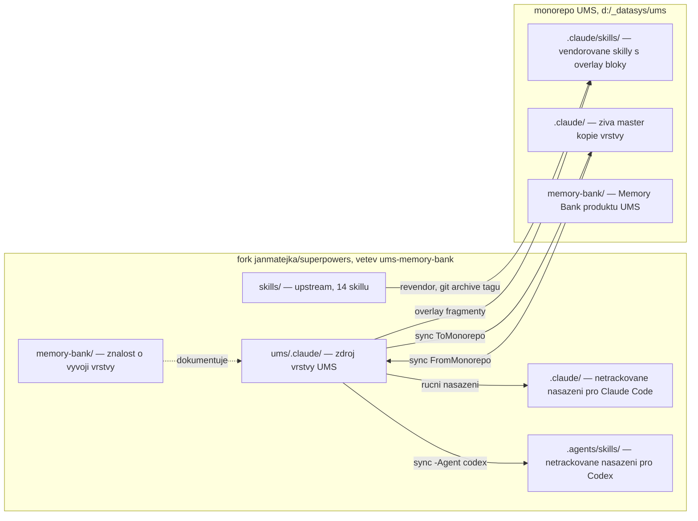
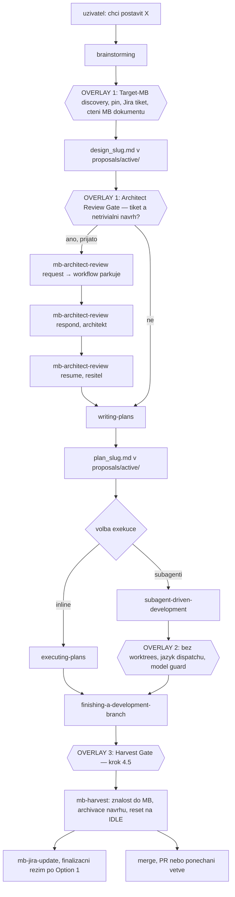
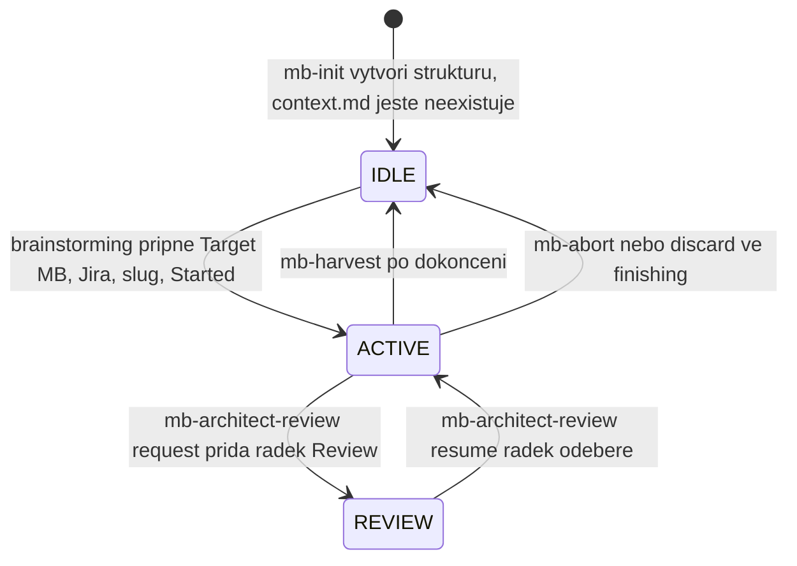
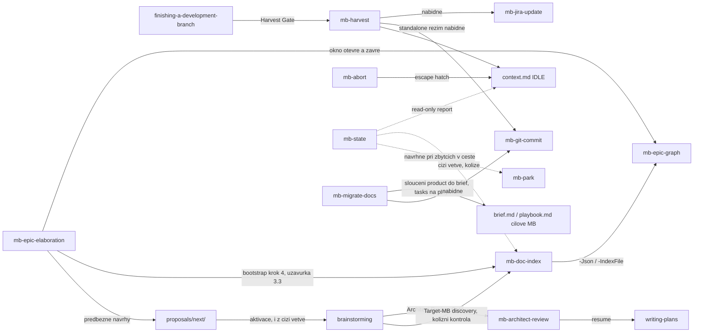
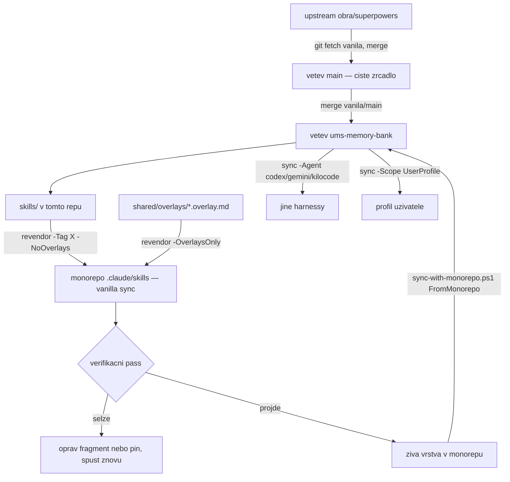

# Architecture

Dokument mapuje tři věci: **z čeho se repozitář skládá**, **jak spolupracuje
workflow Superpowers s vrstvou UMS**, a **jak se vrstva dostane od zdroje
k uživateli**.

## 1. Vrstvy a jejich hranice

| Vrstva | Kde žije | Kdo ji mění |
|---|---|---|
| Upstream skill pack | [`skills/`](../skills/) — 14 skillů | jen upstream (`vanila/main` → `main`) |
| Upstream infrastruktura | [`hooks/`](../hooks/), [`tests/`](../tests/), [`docs/`](../docs/), `.opencode/`, `.pi/`, `.claude-plugin/`, … | jen upstream |
| Normativní zdroj UMS | [`ums/.claude/skills/shared/`](../ums/.claude/skills/shared/) — kontrakt v2.10, manifest, vendor pin, overlay fragmenty | tato větev |
| Utility skilly UMS | [`ums/.claude/skills/mb-*/`](../ums/.claude/skills/) | tato větev |
| Lepidlo pro Claude Code | [`ums/.claude/settings.json`](../ums/.claude/settings.json), [`ums/.claude/hooks/`](../ums/.claude/hooks/) | tato větev |
| Nástroje | [`ums/sync-with-monorepo.ps1`](../ums/sync-with-monorepo.ps1), [`ums/.claude/scripts/revendor-superpowers.ps1`](../ums/.claude/scripts/) | tato větev |
| Znalost o vývoji vrstvy | [`memory-bank/`](.) | tato větev |

**Klíčová hranice:** overlay se nikdy neaplikuje na `skills/` v tomto repu.
Vendorované kopie s overlay bloky vznikají teprve v cíli nasazení (monorepo,
profil uživatele, lokální `.claude/` tohoto repa). Zdrojový `skills/` zůstává
byte-identický s upstreamem, proto je merge upstreamu vždy bezkonfliktní.

Nasazené kopie v tomto repu (`.claude/`, `.agents/skills/`) jsou **netrackované**
(upstream `.gitignore` ignoruje každý `.claude/`) a mohou být za zdrojem —
autoritou je vždy `ums/.claude/`. Sezení v tomto repu ale běží nad nasazenou
kopií, takže po změně zdroje je nutné nasazení obnovit, jinak agent pracuje se
starou verzí vrstvy.

## 2. Workflow Superpowers a body zásahu UMS

Superpowers řídí životní cyklus práce. UMS do něj vstupuje **přesně třemi
overlay bloky** plus sadou skillů volaných z těchto bloků.

### Overlay 1 — `brainstorming`

Fragment [`brainstorming.overlay.md`](../ums/.claude/skills/shared/overlays/brainstorming.overlay.md),
ukotvený na konec souboru. Upstream v6.3.0 nejdřív klasifikuje request na tři
cesty (spike / bounded / architectural) a fragment je mapuje na dokumentovou
vrstvu (kontrakt, podsekce „Brainstorming Paths"): architektonická i bounded
cesta běží vstupní bránu celou a obě produkují `design_<slug>.md` — bounded
pak nepíše plán a nepouští SDD; spike nepinuje nic, větev dostane, jen když
sahá na strom, a do `proposals/` nezapisuje. Na upstream checklist fragment
odkazuje jmény fází, ne pořadovými čísly (každá cesta čísluje vlastní
položky). Zásahy do architektonické cesty:

- **Fáze „Explore project context"** navíc spouští **Target-MB discovery**:
  najít cílovou Memory Bank (lokální sken sloučený s indexem skillu
  [`mb-doc-index`](../ums/.claude/skills/mb-doc-index/) nad `origin` —
  model tahu, kandidáti napříč větvemi), aktivovat případný předběžný návrh
  z `proposals/next/` (i na cizí větvi — převzetí je kopie blobu, viz sekce
  3), zeptat se na Jira tiket, **zvolit bázi integrace** — kandidáti jsou
  chráněné větve reálně existující na `origin` (`Get-UmsBaseCandidates`),
  řazené výchozí první, pak větev, na které sezení stojí, pak (fail-open)
  zmínka verze v textu tiketu; o volbě rozhoduje vždy uživatel — poté
  **znovu spustit index s deklarovaným záměrem** (`-Jira`/`-Slug`) pro
  meziclonovou kolizní kontrolu — nález `KOLIZE AKTIVNÍ PRÁCE` je
  fail-closed stop, cizí aktivní práce jiných tiketů je jen informace —
  zapsat `Target MB Pin`, `Jira`, `Work item`, `Started` a (jen když
  zvolená báze není `baseRef`) řádek `Báze:` do `context.md`, přečíst
  dokumenty cílové MB jako kontext návrhu.
- **Fáze „Write design doc"** (u bounded zápis návrhu schváleného v chatu,
  bez druhého kola review) přesměruje uložení z upstream cesty
  `docs/superpowers/specs/` na `<PLAN_MB>/proposals/active/design_<slug>.md`
  (česky, s hlavičkou dle kontraktu) a vyžaduje větev na místě místo worktree
  (`git switch -c <TIKET>-<slug> <zvolená báze>` po `git fetch origin` —
  tiketový workspace nemá lokální bázi; báze je ta, kterou bod 1 právě
  zvolil, ne nutně `baseRef`); po commitu návrhu ho agent pushuje —
  publikace vlastní větve po každém commitu je obecné pravidlo, ne jen tento
  jeden krok (sekce 3).
- **Nabídka agentické oponentury** (jen architektonická cesta, po schválení
  zapsaného návrhu, PŘED nabídkou Architect Review Gate): per kontrakt, sekce
  „Agentic Design Opposition (oponentura)" — nabídka, nikdy automatický běh.
  Nezávislý subagent s čistým kontextem (nejsilnější model, nejvyšší effort)
  posoudí návrh proti MB dokumentům i kódu; nálezy s povinnou evidencí projdou
  triáží (nesporné rovnou do návrhu, sporné dávkovým dialogem s uživatelem,
  mylné odmítnuty s důvodem) a změněné pasáže se re-approvují — teprve pak je
  návrh finálně schválen.
- **Architect Review Gate** (jen architektonická cesta, po schválení zapsaného
  návrhu): s navázaným tiketem se VŽDY nabídne design review architektem.
  Přijetí znamená konec workflow v tomto sezení — pokračuje se až režimem
  resume. Na bounded cestě se gate nenabízí — přání review je signál pro
  upgrade cesty.
- **Epic Backflow check** po finálním schválení návrhu (kontrakt, sekce „Epic
  Backflow (design → epic)"): s tiketem a dostupnou Jirou se spustí
  `mb-epic-graph -Check`; nález k tomuto tiketu vždy zafrontuje poznámku do
  dirty-setu ledgeru epiku (bez ledgeru do `notes.md` vedle něj) a nabídne
  inline elaborační okno na hranici fáze (přepnutí na elaborační větev
  z `<baseRef>`, po uzávěrce návrat na tiketovou větev), nebo odklad. Krok je
  fail-open, elaborace se nikdy nespouští bez rozhodnutí uživatele; proběhlo-li
  review, krok patří do resume `mb-architect-review`, ne sem.

### Overlay 2 — `subagent-driven-development`

Fragment [`subagent-driven-development.overlay.md`](../ums/.claude/skills/shared/overlays/subagent-driven-development.overlay.md),
na konec souboru. Nemění smyčku tasků, jen její dispatch pravidla:

- **model** — platí upstream Model Selection; UMS jen požaduje explicitní model
  u každého dispatche a nejlevnější tier pro čistě summarizační práci,
- **jazyk** — dispatch prompty, briefy, reporty a ledger anglicky, commit
  messages implementátorů a výstupy pro uživatele česky,
- **izolace** — worktrees zakázané, krok `using-git-worktrees` se řeší jako
  větev na místě,
- **playbook** — před baseline kontrolou a u KAŽDÉHO dispatche implementátora
  se dořeší procedurální dokument cílové MB (`playbook.md`, jinak legacy
  `tasks.md`, jinak žádný) a předá se jako závazné postupy vedle task briefu;
  z něj se čerpají i příkazy pro baseline build/test kontrolu,
- **kandidáti playbooku** — report každého implementátora končí sekcí
  `## Playbook candidates` (povinná trojice polí `Tried`/`Happened`/`Procedure`,
  volitelně `Target MB`/`Corrects`); řídicí sezení potvrzené položky beze
  změny kopíruje do `<MB_ROOT>/.superpowers/playbook-candidates/<slug>.md`
  (jeden soubor na slug aktuální práce), odkud je na konci větve čte
  harvestová brána (Overlay 3); `mb-park` soubor při odkládání práce
  commitne (`git add -f`) — od té chvíle je to živý zaparkovaný důkaz, který
  se jen doplňuje, ne přepisuje, a maže ho až harvest,
- **base sync** — báze se mergne do tiketové větve na hranicích fází, nikdy
  uprostřed tasku: povinně před dispatchem prvního tasku (`git fetch origin`
  + `merge <baseRef>`, s posouzením průniku a odstupňovanou verifikací),
- **publikace** — agent pushuje vlastní větev po každém commitu (obecné
  pravidlo, sekce 3); před dispatchem prvního tasku je to commit s plánem,
  vedle povinné baseline build/test kontroly.

### Overlay 3 — `finishing-a-development-branch`

Fragment [`finishing-a-development-branch.overlay.md`](../ums/.claude/skills/shared/overlays/finishing-a-development-branch.overlay.md),
vložený **před** řádek `## Step 5: Execute Choice` — jediný fragment s
kotvou `ANCHOR-BEFORE`, tedy jediný citlivý na drift upstreamu. Přidává krok
4.5 a přepisuje variantu 1:

- u všech tří variant (merge / PR / ponechat) nejprve `mb-harvest`, pak commit
  MB změn a push tiketové větve, teprve potom vlastní varianta,
- **varianta 1 („Merge back to `<base-branch>` locally") se nahrazuje
  integrací FF pushem tiketové větve na `<baseRef>`** — žádný lokální
  `git checkout <base-branch>`, `git pull`, lokální merge ani `git branch -d`;
  tiketový workspace nemá lokální bázi, a i kdyby existovala, nemergne se.
  Sekvence: base sync na této hranici fáze (`git fetch origin` + `merge
  <baseRef>`) PŘED harvestem → harvest, commit a push → znovu `fetch` +
  `merge <baseRef>` (báze se mohla mezitím pohnout) → zelená verifikace na
  slouženém stromu → agent připraví lidský příkaz s výčtem odchozích commitů
  (`! UMS_ALLOW_SHARED_PUSH=1 git push origin HEAD:<baseBranch>`, refspecový
  tvar, protože integrace pushuje tiketovou větev na bázový ref) → uživatel
  ho spustí → agent ověří dosažitelnost **z báze**
  (`git merge-base --is-ancestor <sha> <baseRef>`, ne `git branch -r
  --contains`, který by nahlásil ticketovou větev, kam už publikační pravidlo
  commit pushlo, a míjel by tak právě stav, který krok ověřuje),
- push zamítnutý jako non-fast-forward = báze se pohnula mezitím, opakuje se
  od fetchi; **strop dvě kola**, potom STOP a report uživateli,
- po ověřeném FF pushu do báze, s navázaným tiketem, `mb-jira-update` ve
  finalizačním režimu (tiket přechází přímo do „Test", ruší se Flagged);
  dokud FF push neproběhne, finalizace se zastaví na vlastní bráně
  dosažitelnosti,
- discard cesta neharvestuje: oba soubory páru jdou do `proposals/abandoned/`,
  `context.md` se resetuje, tento pohyb se commitne a pushne na tiketové
  větvi (stejně jako každý jiný commit) a teprve pak se lokální větev smaže —
  `git switch --detach <baseRef>` (nemá se kam vrátit, žádná lokální báze) a
  `git branch -d`; vzdálená větev se nikdy nemaže.

### Co Superpowers vlastní bez zásahu UMS

Smyčku tasků SDD (implementátor → task review → fix loop max 5 kol → adjudikace
na stropu), pracovní adresář plánu `.superpowers/sdd/<plan-basename>/` s
ledgerem `progress.md`, finální whole-branch review, volbu modelu, pravidla TDD
a systematického debuggingu. Kontrakt tento scratch tree explicitně vyjímá ze
scope locku Memory Bank.

## 3. Publikace a viditelnost napříč větvemi

Aktéři pracují každý ve svém clonu a tiketové větvi a nevidí se navzájem,
dokud se něco nesloučí. Vrstva to řeší modelem tahu (dokumenty se hledají, ne
tlačí) a publikačním invariantem (co se zveřejní, musí být dosažitelné).
Normativní zdroj: kontrakt v2.10, sekce **Publication Contract** a
**Cross-Branch Visibility**.

### Model tahu — `mb-doc-index`

[`mb-doc-index`](../ums/.claude/skills/mb-doc-index/) (sourozenec
`mb-epic-graph`, čistě read-only) indexuje dokumenty napříč větvemi na
`origin`: jedno čtení `for-each-ref` vybere kandidátní větve podle **stáří
jejich tipu** (`-SinceDays`, ne podle data jednotlivých commitů), survivory
prochází traversal beze časového omezení
([`doc-index.ps1`](../ums/.claude/skills/mb-doc-index/scripts/doc-index.ps1);
jména refů se do `git log` předávají přes `--stdin`, protože stovky refů
překročí limit příkazové řádky Windows), omezený i cestou a bází
(`-BaseRef`); deklarovaný záměr (`-Jira`/`-Slug`) enumeruje úplně bez
časového okna. Výsledek se slučuje s lokálním working tree (pseudo-větev
`local`, jeden `git ls-files --cached --others --exclude-standard`, bez
rekurzivního průchodu adresářů) a s obsahem báze (pseudo-větev `base`) do
jednoho indexu. Změřený výkon je v [tech.md](tech.md).
Výstup je česká tabulka pro člověka plus `-Json <path>` pro strojové
konzumenty (Target-MB discovery, `mb-epic-graph -IndexFile`,
`mb-epic-elaboration` bootstrap). Nálezy jsou rozhodovací kandidáti pro
člověka, ne automatické opravy: `KOLIZE AKTIVNÍ PRÁCE` (stejný slug/tiket
aktivní na cizí větvi — CHYBA, exit 2, zastavuje pinování nové práce),
`DRAFT NA VÍCE VĚTVÍCH`, `FRONTA I DOKONČENO` (VAROVÁNÍ), `CIZÍ AKTIVNÍ
PRÁCE` (normální paralelní provoz jiných tiketů, jen informace, exit 0).
`KOLIZE AKTIVNÍ PRÁCE` funguje i s prázdnou lokální množinou (discovery běží
dřív, než návrhový dokument vznikne) jen s **deklarovaným záměrem**
(`-Jira`/`-Slug`); bez něj degraduje na `CIZÍ AKTIVNÍ PRÁCE` a nezastaví nic.

Převzetí draftu z cizí větve je **kopie blobu** (`git show <ref>:<path> >
<path>`), nikdy cherry-pick — elaborační okno se zavírá jedním commitem
nesoucím ledger i všechny proposaly okna, takže cherry-pick by přitáhl cizí
ledger. Převzatý dokument nese v hlavičce `**Převzato z:** <branch>@<sha>`.
Tiketová větev se zakládá vždy explicitním počátečním bodem `<baseRef>`
(`git switch -c <TIKET>-<slug> <baseRef>` po `git fetch origin`) — lokální
báze se v tiketovém workspace nepoužívá ani neaktualizuje, jinak by větev
neviděla ani mergnuté plánování. Obživlá fronta (originál draftu zůstane
v `next/` na zdrojové větvi a znovu se objeví v bázi po jejím mergi) je
detekovaná (`mb-doc-index`, `mb-epic-graph -Check`), ne bráněná — úklid je
jeden `git rm`.

### Publikační invariant a dvouúrovňová push policy

**Žádná reference bez dosažitelnosti:** kdykoli vrstva pojmenuje git objekt
mimo clon (odkaz v popisu/komentáři tiketu, tabulka vln, předávací komentář,
ledger), pinovaný commit musí být v tu chvíli dosažitelný na `origin`;
nedosažitelnost je fail-closed stop, ne varování. Pravidlo publikace je
kontinuální, ne bodové: **agent pushuje vlastní tiketovou větev po každém
commitu** a vždy ohlásí větev a odchozí commity — commit, který nejde na
`origin`, vidí jen tento workspace. Sedm míst kontraktu (po commitu návrhu,
po commitu plánu před prvním dispatchem, po commitu implementátora za
zelený task, po mergi báze do tiketové větve, při uzávěrce elaboračního
okna, před každým handoffem, po harvestu) jsou jen významné případy téhož
pravidla, ne úplný výčet.

Běžné ověření dosažitelnosti je `git fetch origin` + `git branch -r
--contains <sha>` (prázdný výsledek = nedosažitelné). **Integrace je
výjimkou**: publikační pravidlo commit už pushlo na tiketovou větev, takže
by `--contains` nahlásil dosažitelnost i ve chvíli, kdy se commit do báze
ještě nedostal — proto se dosažitelnost při integraci ověřuje **z báze**:
`git merge-base --is-ancestor <sha> <baseRef>`.

| Úroveň | Pravidlo |
|---|---|
| Vlastní tiketová větev (nechráněná) | Agent pushuje sám po každém commitu a vždy ohlásí větev a odchozí commity — publikace vlastní větve je oznámení, ne otázka k rozhodnutí. Force push zakázán. |
| Sdílené větve (efektivní seznam je `protectedBranches` z `ums-repo.json`, vestavěný fallback `develop`, `main`, `master`, `release/*`) | Agent nepushuje nikdy. Připraví přesný příkaz s výčtem commitů; uživatel ho schválí nebo spustí sám — refspecový tvar, protože integrace pushuje tiketovou větev na bázový ref: `! UMS_ALLOW_SHARED_PUSH=1 git push origin HEAD:<baseBranch>` (`<baseBranch>` je `baseRef` bez remote prefixu). Agent poté znovu ověří dosažitelnost. |

`UMS_ALLOW_SHARED_PUSH=1` je lidská úniková cesta: git hook nepozná člověka
od agenta, takže bez explicitní výjimky by pravidlo o sdílených větvích bylo
neproveditelné (vrstva podá uživateli příkaz a její vlastní hook by ho
zamítl). Zvedá jen tohle jedno pravidlo — mazání větve a force push zůstávají
zakázané i s ní. Výjimka patří **člověku; agent ji nikdy nenastavuje**.

### Dvouvrstvá mechanika vynucení

Skutečnou hranicí je git `pre-push` hook
([`ums/.claude/hooks/pre-push`](../ums/.claude/hooks/pre-push), POSIX `sh`,
bez přípony) — git mu předá už rozparsované čtveřice `<local-ref> <local-sha>
<remote-ref> <remote-sha>`, takže neexistuje shellové parsování k obejití.
Chráněné patterny čte z vygenerovaného textového seznamu (jeden glob na
řádek, protože POSIX `sh` neumí JSON) — zdrojem je `protectedBranches`
z [`ums-repo.json`](ums-repo.json); bez konfigurace nebo seznamu spadá na
vestavěnou čtveřici `develop`, `main`, `master`, `release/*`, tedy vždy
k víc ochraně, nikdy k méně (generování a chybové stavy jsou v
[tech.md](tech.md)). Zamítá: chráněný cílový ref (s výjimkou
`UMS_ALLOW_SHARED_PUSH=1`), mazání větve a non-fast-forward (force) push;
scope je `refs/heads/*`, tagy procházejí vždy. `--no-verify` ho obchází a
`core.hooksPath` ho může přesměrovat jinam (relativní hodnota per-worktree) —
proto ho instaluje per-clone
[`install-git-hooks.ps1`](../ums/.claude/hooks/install-git-hooks.ps1) (cíl
řeší přes `git rev-parse --git-path hooks/pre-push`, tedy správně i pro
linked worktree a `core.hooksPath`; vícekolovým sebetestem ověřuje, že
nainstalovaný hook skutečně zamítá i propouští, ne jen jedno z toho, a že
skutečně čte vygenerovaný seznam, ne jen vestavěný fallback), volané i ze
[`sync-with-monorepo.ps1`](../ums/sync-with-monorepo.ps1) při `-Scope
Monorepo` pro libovolného `-Agent`.

**Efektivní báze pracovní položky** může být jiná než repozitářová výchozí
`baseRef` — typicky servisní větev řady `Branches/5.37` místo `develop` —
a kontrakt vynucuje invariant „integrační větev je vždy chráněná větev":
efektivní báze musí odpovídat některému vzoru efektivních `protectedBranches`,
jinak je zvolená báze fail-closed stop s pořadím nápravy (cílený zápis vzoru
do `ums-repo.json` → nový běh `install-git-hooks.ps1` → strojový self-test na
té konkrétní větvi → teprve pak založení tiketové větve a commit konfigurace
na ní). Efektivní bázi čte řádek `- **Báze:**` v `context.md` (zapsaný jen
když se báze liší od `baseRef`, jinak čtení padá na `baseRef`); zachovává ho
IDLE reset stejně jako řádek `Jira:`, protože integrace ho potřebuje ještě po
harvestu. Porovnání jména větve se vzory chráněných větví existuje ve vrstvě
dvakrát nezávisle na sobě (`pre-push`, `guard-git-push.mjs`), takže třetí,
instrukční kopie v těle skillu by rozhodnutí „je báze chráněná?" přestala
dělat strojově — proto sdílené skripty vedle
[`Get-UmsRepoConfig.ps1`](../ums/.claude/skills/shared/scripts/Get-UmsRepoConfig.ps1):
[`Test-UmsProtectedBranch.ps1`](../ums/.claude/skills/shared/scripts/Test-UmsProtectedBranch.ps1)
(jméno větve × vzory, vrací `Matched`/`Evaluated`/`BadPatterns` — vadný glob
jako `Maint/[0-9` se počítá jako neshoda a je jmenovitě nahlášen, ne jen
tiše přeskočen), [`Get-UmsBaseCandidates.ps1`](../ums/.claude/skills/shared/scripts/Get-UmsBaseCandidates.ps1)
(chráněné větve reálně existující na `origin`, řazené výchozí → aktuální →
ostatní) a [`Get-UmsEffectiveBase.ps1`](../ums/.claude/skills/shared/scripts/Get-UmsEffectiveBase.ps1)
(řádek `Báze:` s fallbackem na `baseRef`; nesrozumitelný řádek — komentář za
hodnotou, prázdná hodnota, chybějící diakritika — hlásí v `Malformed` a
nepočítá se jako „řádek chybí"). Tyto tři skripty čtou (nebo zpřísňují STOP)
`mb-park`, `mb-state`, `mb-jira-update`, `mb-architect-review`, `mb-harvest`
a všechny tři overlay fragmenty; `Get-UmsRepoConfig.ps1` se neměnil —
per-položková báze není konfigurace repozitáře.

Vedle něj běží `guard-git-push.mjs` jako PreToolUse hook — **demotovaný**
z původní role bezpečnostní hranice na fail-open rychlé varování. Dvě kola
review experimentálně prokázala, že parsování shellového příkazu hranicí být
nemůže: deny-listem i allowlistem s vlastním tokenizerem šly obejít reálné
tvary pushe do chráněné větve. Co bezpečně rozparsuje jako push do chráněné
větve nebo `--no-verify`, zamítne hned a česky; čemu nerozumí, propustí —
skutečným backstopem zůstává ochrana větví na serveru.

Zapojení do zbytku vrstvy: `mb-jira-update` finalizace se spouští přímo
ověřeným FF pushem do báze; overlay `finishing-a-development-branch`
nahrazuje Option 1 integrací FF pushem (výše) místo publikace lokálního
`develop`; overlay `subagent-driven-development` pushuje po každém zeleném
tasku a mergne bázi před prvním dispatchem; `mb-architect-review` krok 4
(handoff push) odkazuje na tento invariant místo vlastního pravidla.

## 4. Dokumentová vrstva

Normativní zdroj: [kontrakt v2.10](../ums/.claude/skills/shared/UMS_MEMORY_BANK_CONTRACT.md).

**Trojvrstvý model adresářů**

| Pojem | Definice | V tomto repu |
|---|---|---|
| `MB_ROOT` | `git rev-parse --show-toplevel` — jediný discovery krok | kořen forku |
| `CTX_DIR` | `<MB_ROOT>/memory-bank/` — orchestrační kořen, drží `context.md` | [`memory-bank/`](.) |
| `PLAN_MB` | `<MB_ROOT>/<Target MB Pin>` — MB, kterou práce cílí | `memory-bank/` (práce je repo-wide) |
| `AFFECTED_MBS` | MB dotčené harvestem, derivované z diffu větve | v tomto repu vždy `memory-bank/` |

**Sada dokumentů projektové MB.** Povinné jádro je `brief.md`, `architecture.md`,
`tech.md`. Prvotřídní volitelný dokument je `playbook.md` — preskriptivní
postupy (jak se projekt staví, testuje a nasazuje), autorsky lidský a ze
zkušenosti, ne odvozený z kódu. Volné rozšíření je libovolný další dokument
(`data-flows.md`, `tasks.md`, …) bez normativního statusu. Jeden fakt má jeden
domov:

| Otázka, na kterou fakt odpovídá | Domov |
|---|---|
| K čemu to je, pro koho, jaká je hodnota, v jakém je stavu | `brief.md` |
| Z čeho se skládá, kdo s kým mluví jak, jaký vzor sleduje | `architecture.md` |
| Na čem to běží — stack, verze, závislosti, konfigurace, build | `tech.md` |
| Jak udělám X — příkazy, postupy, konvence, pasti | `playbook.md` |

Rozhodovací test pro spornou dvojici `tech` × `architecture`: mění se fakt při
výměně knihovny nebo verze beze změny kódu → `tech.md`; mění se při přepsání
kódu beze změny závislostí → `architecture.md`; mění se v obou případech →
patří tam, kde ho čtenář hledá první, druhý dokument na něj jen odkazuje a
neopakuje ho.

**Playbook má chráněný konzultační režim.** `playbook.md` se NIKDY nemění bez
schválení uživatele — na rozdíl od `brief.md`/`architecture.md`/`tech.md` ho
harvest neprochází automatickým current-state průchodem, protože jeho obsah
nejde ověřit proti kódu. `mb-sync` navrhuje opravu hned v okamžiku nálezu
driftu; `mb-harvest` sbírá kandidáty do jedné brány na konci větve — obě cesty
jsou legitimní, žádná není drift k narovnání vůči druhé. Obě čerpají z
`<MB_ROOT>/.superpowers/playbook-candidates/<slug>.md` — jeden soubor na
slug aktuální práce (git-ignored scratch,
anglicky), do kterého implementátorské subagenty SDD hlásí zkušenosti v sekci
reportu `## Playbook candidates` (povinná pole `Tried`/`Happened`/`Procedure`,
volitelně `Target MB`/`Corrects`) a řídicí sezení je beze změny kopíruje.
Soubor cizího slugu se nikdy nepřepisuje ani nemaže. Odložení práce
(`mb-park`) soubor aktuálního slugu commitne (`git add -f`, jmenovaná
výjimka z git-ignore) — od té chvíle je to živý zaparkovaný důkaz: další
práce na tomtéž slugu do něj jen přidává, přepsat ho může jen harvest po
zápisu do `playbook.md`. Netrackovaný soubor cizí nebo dokončené práce naopak
smí být přepsán, protože v něm nic živého nezůstává. Výjimku má jen první
`playbook.md`, který `mb-init` napíše z detekovaných build/test příkazů — ten
schválení nepotřebuje, další zápisy ano.

**Legacy tvar zůstává trvale platný.** Starší `product.md` vedle `brief.md`,
nebo `tasks.md` místo `playbook.md`, nikdo nemusí migrovat. Skill
[`mb-migrate-docs`](../ums/.claude/skills/mb-migrate-docs/) na požádání sloučí
`product.md` do `brief.md` a přejmenuje `tasks.md` na `playbook.md` napříč
zadaným rozsahem, včetně přepisu relativních odkazů; MB, které legitimně drží
`tasks.md` (otevřené položky) i `playbook.md` (postupy) současně — jako tato —
hlásí `KONFLIKT PLAYBOOKU` a migraci pro ně přeskočí, rozhodnutí nechává na
uživateli.

**Pracovní položka** = pár `design_<slug>.md` (návrh, píše brainstorming) +
`plan_<slug>.md` (plán, píše writing-plans) v `proposals/active/`. Jedna
aktivní položka **na větev**, ne na repozitář — každá větev nese svůj pin ve
vlastním `context.md`. Fail-closed stop nastává jen když je druhý aktivní
slug na TÉTO větvi neobnovitelný z `origin` (necommitnuté změny nebo
nepushnuté commity); zaparkovaná práce (`mb-park`) na jiné lokální větvi je
normální provoz, jen se ohlásí. Slug začíná kódem tiketu, když je znám
(`ums_3361_design_review_workflow`).

**Archivační asymetrie:** dokončení uchová jen návrh v `proposals/completed/`
a plán **smaže** (jeho kroky jsou vyčerpané, výsledek nese kód, git historie
a aktualizované MB dokumenty). Opuštění přesune **oba** soubory do
`proposals/abandoned/` a nemaže nic.

**Předběžné položky** čekají jako samostatné `design_<slug>.md` v
`proposals/next/`; nezapočítávají se do limitu aktivních prací a aktivují se
přesunem do `active/` při Target-MB discovery.

**Grandfather:** starší pojmenování `proposal_<slug>-design.md` /
`proposal_<slug>.md` zůstává platné všude, kde leží; nepřejmenovává se, jedinou
výjimkou je aktivace předběžného návrhu z `next/`.

**Stav v `context.md`**

Zapisovatelé `context.md` jsou právě tři: řídící sezení při Target-MB discovery,
`mb-harvest` / `mb-abort` (reset na IDLE) a `mb-architect-review` (jen řádek
`Review:`). Dokud řádek `Review:` existuje, writing-plans se nesmí spustit.

**Harvest style je závazně „current-state":** MB dokumenty popisují přítomný
stav jako referenční dokumentace. Datované changelogové sekce („Nedávné změny",
„Recent Changes") jsou zakázané — historie žije v `proposals/completed/` a
v gitu.

## 5. Skilly UMS a jejich vazby

| Skill | Role | Volán odkud |
|---|---|---|
| `mb-init` | Vytvoří strukturu `memory-bank/` — režim orchestračního kořene nebo projektové MB, včetně `ums-repo.json` detekovaného z topologie repozitáře (první verze bez schválení, stejná výjimka jako u prvního `playbook.md`). Nikdy netvoří `context.md`. | ručně |
| `mb-state` | Read-only orákulum stavu i způsobilosti workspace: pin, slug, úplnost páru, SDD ledger, větev, staleness, `pre-push` hook a `ums-repo.json`, zbytky ve workspace (v cestě / jen přítomné), zaparkovaná práce na jiných lokálních větvích, vzdálenost od báze, invariant „báze nesmí nést ACTIVE pin". | ručně |
| `mb-harvest` | Složí znalost do dotčených MB (current-state faktů i playbookové brány), archivuje návrh, smaže plán, resetuje na IDLE. Zákaz git operací — commit vlastní volající. | Harvest Gate ve finishing, nebo ručně |
| `mb-abort` | Opuštění práce: oba soubory páru do `abandoned/`, reset `context.md` na IDLE, commit a push tohoto pohybu na tiketové větvi. Mazání lokální větve (detach na `<baseRef>` + smazání) dělá až finishing Discard, ne `mb-abort` samotné. | ručně |
| `mb-park` | Odloží aktivní práci beze ztráty: commit rozpracovaného, push tiketové větve, commit kandidátů playbooku aktuálního slugu (`git add -f`), ohlášení zbytků. `context.md` zůstává ACTIVE — pár zůstává v `active/`. STOP dřív, než cokoli commitne, když aktuální větev odpovídá kterémukoli vzoru efektivních `protectedBranches` (`Test-UmsProtectedBranch`), ne jen odvozené bázi — jednodušší i přísnější než dřívější kontrola jediné hodnoty. Třetí konec životního cyklu vedle dokončení a opuštění. | ručně, nebo z entry gate při zbytcích v cestě |
| `mb-architect-review` | Design review živým architektem přes tiket (request / respond / resume) plus samostatný režim `oppose` — agentická oponentura návrhu bez Jira side effectů (per kontrakt, sekce „Agentic Design Opposition"). Branch sync dle tiketu, publikace vlastní větve dle Publication Contract (ohlášená, ne na souhlas). Respond zapisuje posudek do Jiry až po explicitní schvalovací bráně (souhrn → konverzace → brána → publikace) a může si vyžádat oponenta jako pomocníka posudku. Request komentář vždy začíná markerem `[DESIGN REVIEW]`; chybí-li v Jiře přechod do „Design Review", request spadne na stav „Review" a marker oba stavy rozliší (kontraktový fallback). Resume po schválení návrhu spouští Epic Backflow check. | Architect Review Gate, nabídka oponentury v brainstormingu, nebo ručně |
| `mb-jira-update` | České shrnutí implementace do Jira; brána dosažitelnosti (§6b) před zápisem odkazu; finalizační režim posune tiket do „Test" jen po publikaci merge commitu. | z `mb-harvest`, z finishing, nebo ručně |
| `mb-git-message` / `mb-git-commit` | Návrh commit message / scoped commit. Nikdy nepushují. | ručně, z `mb-harvest`, z `mb-migrate-docs` |
| `mb-sync` | Dosynchronizuje MB dokumenty s realitou kódu mimo workflow; drift `playbook.md` jen navrhuje ke schválení, nezapisuje ho sám. | ručně |
| `mb-scan` | Read-only hloubková analýza projektu. | ručně |
| `mb-epic-elaboration` | Iterativní rozpracování epiku po ohraničených oknech: evidence ledger, dirty-set, invarianty, předběžné návrhy do `next/`. Framing okna čte i poznámky zpětného toku z návrhů (dirty řádky `návrh <slug>`, `notes.md`). | ručně, nebo inline okno z Epic Backflow kroku |
| `mb-epic-graph` | Graf závislostí epiku z Jira linků nebo z hlaviček návrhů, plus orákulum konzistence text ↔ linky a `-IndexFile` findings o cizích větvích. Read-only skript. | z `mb-epic-elaboration`, nebo ručně |
| `mb-doc-index` | Read-only index MB dokumentů napříč větvemi `origin` (model tahu); kolizní findings pro discovery, elaboraci i `mb-state`. | z brainstormingu (discovery), z `mb-epic-elaboration`, z `mb-state`, nebo ručně |
| `mb-migrate-docs` | Migruje Memory Banky v zadaném rozsahu na aktuální sadu dokumentů — sloučí `product.md` do `brief.md`, přejmenuje `tasks.md` na `playbook.md`, přepíše relativní odkazy; MB s `KONFLIKT PLAYBOOKU` (`tasks.md` i `playbook.md` současně) přeskočí a nahlásí. | ručně, pro repozitáře ve starém tvaru |
| `mb-plan`, `mb-act` | Deprecated stuby v1 — jen přesměrují na Superpowers workflow. | zpětná kompatibilita |

Nástroje s vlastním kódem a testy: `mb-epic-graph`
([`epic-graph.ps1`](../ums/.claude/skills/mb-epic-graph/scripts/epic-graph.ps1) —
generování grafu, vlny, rozhodovací stavové ikony, strukturální i prose
orákulum), `mb-epic-elaboration`
([`ledger-status.ps1`](../ums/.claude/skills/mb-epic-elaboration/scripts/ledger-status.ps1)),
`mb-doc-index`
([`doc-index.ps1`](../ums/.claude/skills/mb-doc-index/scripts/doc-index.ps1) —
traversal historie vzdálených větví, enumerace, findings) a `mb-migrate-docs`
([`migrate-mb-docs.ps1`](../ums/.claude/skills/mb-migrate-docs/scripts/migrate-mb-docs.ps1)
— plán i `-Apply` mechanické migrace, a
[`verify-deletion-only.ps1`](../ums/.claude/skills/mb-migrate-docs/scripts/verify-deletion-only.ps1)
— ověřuje, že agentický úklid duplicity v mergnutém `brief.md` jen mazal a
přeskupoval řádky, nikdy nepsal nové). Ostatní `mb-*` skilly jsou čistě
instrukční Markdown.

## 6. Vendoring a nasazení

Pipeline má dvě fáze. **Vendoring** vyrábí kopie upstream skillů s overlay
bloky, a to až v cíli nasazení (klíčová hranice, sekce 1); jeho výstup propouští
až verifikační pass. Fragment smí vedle kotvy nést direktivy
`<!-- ASSERT: <přesný řádek> -->` na nosné věty cílového souboru — miss je
hard error stejně jako u `ANCHOR-BEFORE`, takže i fragmenty ukotvené na `EOF`
detekují drift upstreamu. **Sync vrstvy** (`sync-with-monorepo.ps1`) rozváží vrstvu
samotnou; cíle popisuje tabulka `$AgentTargets` — skills dir / config dir /
instrukční soubor pro `claude`, `codex`, `gemini`, `kilocode` × `Monorepo`,
`UserProfile`.

Příkazy obou fází, jejich pořadí i pravidla o tom, co se kam nenasazuje, jsou
v [playbook.md](playbook.md).

## 7. Invarianty, na kterých vrstva stojí

1. **Aditivnost.** Mimo `ums/` (plus `CLAUDE.md` sekci a `memory-bank/`) se na
   této větvi nic nemění → upstream merge nikdy nekonfliktuje.
2. **Jeden normativní zdroj.** Pravidla jsou v kontraktu; skilly a overlaye na
   něj odkazují. Změna pravidla začíná v kontraktu.
3. **Fail-closed.** Chybějící git, chybějící `memory-bank/`, nedefinovaný
   `PLAN_MB` v okamžiku zápisu návrhu, nejednoznačná cílová MB, druhý aktivní
   slug — vždy zastavit, nikdy neuhádnout.
4. **Superpowers řídí, MB dokumentuje.** UMS nepřebírá exekuci ani volbu modelu.
5. **Bez worktrees.** Izolace = větev na místě.
6. **Dvouúrovňová publikace, žádná tichá sdílená větev.** Vlastní tiketovou
   větev agent pushuje sám a vždy ohlásí; sdílené větve (`develop`, `main`,
   `master`, `release/*`) nepushuje nikdy — připraví příkaz a čeká na
   uživatele (lidská výjimka `UMS_ALLOW_SHARED_PUSH=1`). Vynucuje git
   `pre-push` hook, viz sekce 3.
7. **Jazykový kontrakt.** Trvalé a uživatelské texty česky, AI-facing anglicky
   (vývojářské nástroje vrstvy — `install-git-hooks.ps1`,
   `sync-with-monorepo.ps1`, `revendor-superpowers.ps1` — jsou výjimkou a
   mluví anglicky jako kód kolem nich).

## 8. Specifika Memory Bank tohoto repozitáře

- `memory-bank/` plní současně roli `CTX_DIR` i `PLAN_MB` — repozitář je jeden
  projekt (vrstva UMS) a práce na něm je repo-wide, takže se `Target MB Pin`
  legitimně ukazuje na orchestrační kořen.
- Před zavedením této Memory Bank se páry návrh + plán odkládaly do
  `ums/docs/`; jejich hlavičky proto nesou historickou poznámku, že fork Memory
  Bank nemá. Dokončené návrhy jsou archivované v
  [proposals/completed/](proposals/completed/) v původní podobě.
- Memory Bank produktu UMS (`d:\_datasys\ums\memory-bank\`) je jiná Memory Bank
  — dokumentuje produkt, na kterém se vrstva používá. Tato dokumentuje vývoj
  vrstvy samotné.
